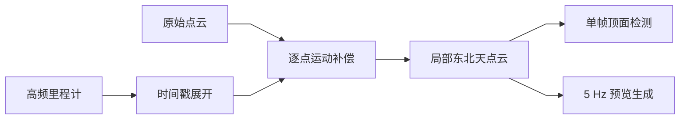
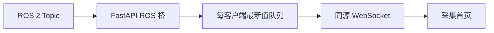
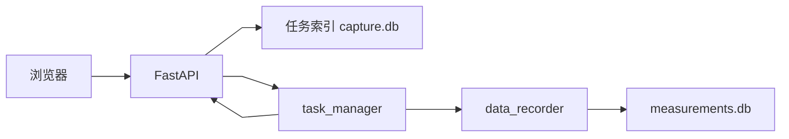

# 数据流设计

文档状态：当前数据流与后续目标并列

核对日期：2026-08-07

## 1. 当前实时点云流



点云补偿结果同时供净空算法和网页预览使用。当前链路不使用 SLAM 点云进行网页显示。

## 2. 网页展示流



点云、净空、RTK 和系统状态使用独立桥和独立 WebSocket。网络慢客户端只丢旧展示数据，
不反压 ROS 2 回调。

## 3. 当前 RTK 和地图流

```text
RTK 串口
→ rtk_driver
→ /capture/rtk/status + /capture/rtk/fix
→ FastAPI
→ /ws/v1/rtk
→ 顶部当前坐标、RTK 指标和高德地图
```

前端只做固定状态文字映射和 WGS84 到 GCJ-02 的地图转换，不判断稳定窗口和进出洞。

## 4. 当前任务控制与历史数据流

```text
创建、查询或逻辑删除任务
→ FastAPI HTTP
→ capture.db

开始、暂停、继续或停止
→ FastAPI HTTP
→ TaskControlBridge
→ task_manager ROS 2 Service
→ data_recorder
→ capture.db + tasks/<task_id>/measurements.db

选择有测量记录的任务
→ FastAPI HTTP
→ tasks/<task_id>/measurements.db
→ 完整高度曲线、统计和 RTK 端点

选择任务或创建日期后清理
→ FastAPI HTTP
→ 物理删除所选 tasks/<task_id>/
→ 保留 capture.db 中的 UUID、时间编号和清理记录
```

任务创建时生成稳定 UUID 和创建时间显示编号 `YYYYMMDD_HHMMSS`。同秒多任务追加
`_02`、`_03`。删除历史任务不会导致编号重排。设备端 `task_manager` 通过 Service 编排记录器，
并通过 `/capture/task/status` 发布可恢复状态。旧批次字段仅用于历史数据库兼容。

## 5. 当前任务控制流



浏览器断线后设备端任务继续。任务参数在开始时冻结。开始流程只标记雷达初始化阶段，不等待
雷达或 RTK 真实数据。入口和出口 RTK 使用最新快照，未确认不阻塞流程。

## 6. 当前净空流

```text
ClearanceResult
→ FastAPI JSON 快照
→ 顶部单值和最近 120 帧曲线
```

无效帧以 `null` 和无效原因传递，曲线断开。当前不累计任务最低值，不叠加安装高度。

## 7. 当前记录流

`data_recorder` 保存两组净空数据。`clearance_source_frames` 保留算法实际源帧；
`clearance_samples` 以 50 Hz 写入最近源帧保持结果。每条 50 Hz 记录保存源帧时间、序号、
源年龄、重复标志和重复序号。没有源帧时写入 `source_unavailable`，源帧超过 250 ms 时写入
`source_timeout`。暂停期间不写 50 Hz 样本。

开始和停止分别保存最新入口、出口 RTK 快照。坐标无效或不存在时记录 `unconfirmed`，不等待
人工确认。停止时完成 SQLite 完整性检查和原子文件重命名。

## 8. 报告流

报告页面显式提交所选任务 UUID 集合。TXT 只读取当前任务。PDF 后端只汇总请求集合中满足正式
记录条件的任务，不依赖旧批次状态。PDF 和 TXT 文件名使用任务或报告生成时间编号。

## 9. 异常原则

- 时间、坐标或位姿证据不足时输出无效或丢弃帧；
- WebSocket 超时不得显示旧值为当前值；
- 浏览器断线不得停止设备端节点；
- 重复记录必须保留源数据关系，不能宣称为 50 Hz 独立传感器测量；
- RTK 端点未确认时保持空值和状态，不补造坐标。
