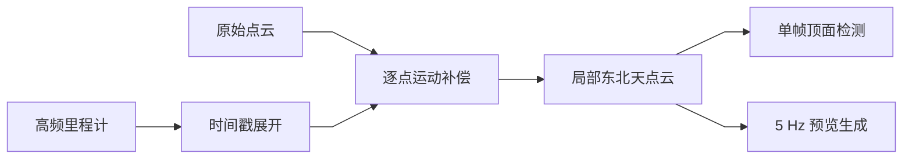
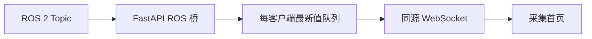
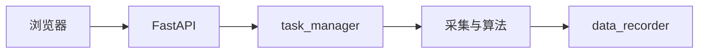

# 数据流设计

文档状态：当前数据流与后续目标并列

核对日期：2026-08-06

## 1. 当前实时点云流



点云补偿结果同时供净空算法和网页预览使用。当前链路不使用 SLAM 点云进行网页显示。

## 2. 网页展示流



点云、净空、RTK 和系统状态使用独立桥和独立 WebSocket。网络慢客户端只丢旧展示
数据，不反压 ROS 2 回调。

## 3. 当前 RTK 和地图流

```text
RTK串口
→ rtk_driver
→ /capture/rtk/status + /capture/rtk/fix
→ FastAPI
→ /ws/v1/rtk
→ 顶部当前坐标、RTK指标和高德地图
```

前端只做固定状态文字映射和 WGS84 到 GCJ-02 的地图转换，不判断稳定窗口和进出洞。

## 4. 当前任务与历史数据流

```text
创建、查询或删除任务
→ FastAPI HTTP
→ capture.db

选择有测量记录的任务
→ FastAPI HTTP
→ tasks/<task_id>/measurements.db
→ 完整高度曲线、统计和 RTK 端点
```

任务创建、查询和逻辑删除已经持久化。开始、暂停和停止仍只修改 React 内存状态，当前没有 ROS 2 Service、Action 或任务 Topic。测量文件读取已经实现，设备端测量写入尚未实现。

## 5. 目标任务控制流



目标实现中，设备端任务状态应在浏览器断线后继续，并允许重连恢复。任务参数在开始时
冻结，停止时完成记录收尾。

## 6. 当前净空流

```text
ClearanceResult
→ FastAPI JSON快照
→ 顶部单值和最近120帧曲线
```

无效帧以 `null` 和无效原因传递，曲线断开。当前不累计任务最低值，不叠加安装高度。

## 7. 目标记录流

`data_recorder` 尚未实现。当前后端只读加载每任务 `measurements.db`，不会从 ROS 2 写入历史记录。后续记录节点应使用有界队列保存任务参数快照、RTK、诊断和结构化净空结果。是否保存原始点云由存储策略决定。

## 8. 异常原则

- 时间、坐标或位姿证据不足时输出无效或丢弃帧；
- WebSocket 超时不得显示旧值为当前值；
- 浏览器断线不得停止设备端节点；
- 任务和记录链路未实现时，界面不得宣称已完成正式采集。
