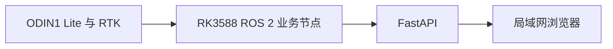
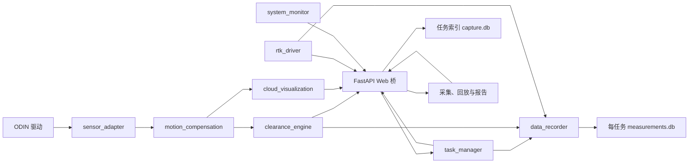
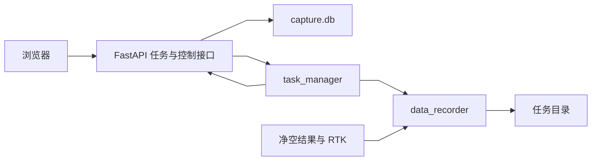

# 系统总体架构

文档状态：当前实现与目标架构并列

核对日期：2026-08-07

适用平台：RK3588、Ubuntu 22.04、ROS 2 Humble

## 1. 系统边界

设备端负责传感器接入、点云处理、算法、任务控制、记录和 Web 服务。浏览器负责显示和操作
入口，不承担核心测量。浏览器关闭或网络中断不能影响 ROS 2 节点运行。

## 2. 当前已实现架构

当前网页预览输入是 `/capture/lidar/points_compensated_enu`，不是厂商 SLAM 点云。

## 3. 分层职责

### 3.1 设备接入

- 第三方 ODIN 驱动默认只读；
- `sensor_adapter` 只做 Topic remapping；
- `rtk_driver` 管理串口和 NMEA 解析；
- Web 后端不直接访问传感器。

实际设备为 ODIN1 Lite，SDK 2.0.2 上报模型字符串 `ODIN2`。厂商前缀只允许在
`sensor_adapter` 启动参数中出现。

### 3.2 实时测量

- `motion_compensation` 展开高频里程计时间戳并逐点补偿；
- `clearance_engine` 输出单帧最低合格近水平顶面距离；
- 当前没有路面模型、通行包络和任务累计净空。

### 3.3 旁路显示和诊断

- `cloud_visualization` 只做受控预览消息生成；
- `system_monitor` 只报告雷达、RTK、控制器和存储事实；
- FastAPI 使用有界最新值队列，不反压实时算法。

### 3.4 浏览器和 FastAPI

采集首页连接点云、净空、RTK、系统状态和任务状态五路 WebSocket。任务创建、查询、控制、
历史读取、本地数据清理和报告下载均通过 FastAPI。浏览器不直接访问 ROS 2。

FastAPI 为任务生成稳定 UUID 和创建时间显示编号。`task_manager` 是单任务运行状态唯一权威
来源。`data_recorder` 生成每任务测量 SQLite 文件。数据回放和报告后端读取同一记录文件。

## 4. 任务与记录架构

任务显示编号为创建时间 `YYYYMMDD_HHMMSS`，同秒冲突追加序号后缀。内部控制、状态键和文件
目录始终使用 UUID。旧 `operation_batches` 和相关字段保留在数据库中，只用于迁移旧数据和兼容
当前仍引用历史字段的内部实现，不在前端展示。

任务开始不等待雷达或 RTK 真实数据检查。入口与出口 RTK 只取最新快照，未确认时保存状态并
继续。记录器保存实际净空源帧和 50 Hz 最近源帧保持序列。重复样本保存来源字段。

## 5. 历史、清理与报告

数据回放按任务创建日期分组。用户可以选择单任务或整日任务集合，调用 FastAPI 物理清理本地
任务目录。普通删除仍为逻辑删除。清理后 UUID、时间编号和任务索引继续保留。

TXT 面向当前任务。PDF 面向用户显式选择的任务集合，不依赖作业批次。正式导出仍要求任务正常
完成、记录来源为 `recorded`、记录完整且存在有效高度。

## 6. 故障边界

| 异常 | 当前或目标行为 |
| --- | --- |
| 点云或位姿不足 | 当前帧无效或丢弃，不沿用旧值 |
| RTK 断开 | 状态灯变红，地图不增加轨迹 |
| 系统诊断超时 | 后端降级，前端清空旧快照 |
| 浏览器断开 | ROS 2 节点继续运行 |
| 预览变慢 | 最新帧覆盖旧帧，不阻塞测量 |
| 记录写入失败 | 记录器发布错误，活动任务标记异常中断并保留可恢复临时文件 |
| 任务管理节点重启 | 活动任务标记异常中断，记录器执行 abort 收尾或关联恢复文件 |
| 浏览器或 FastAPI 重启 | ROS 2 任务继续，重连后从任务数据库和瞬态状态恢复 |

## 7. 测量边界

当前 `lidar_to_top_m` 不能直接用于最终工程净空判定。最终结果需要雷达安装高度、路面基准、
车辆姿态、通行包络和不确定度模型。
