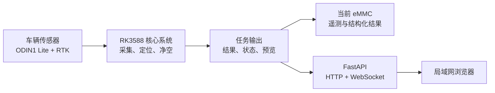
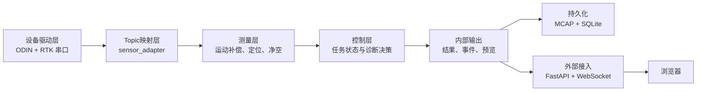
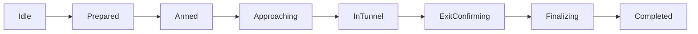

# 系统总体架构

文档状态：设计基线

适用平台：RK3588、Ubuntu 22.04、ROS 2 Humble

关联文档：[ROS 2 架构](ROS2架构.md)、
[数据流设计](数据流设计.md)

## 1. 目的与范围

本系统安装在车辆上，通过 ODIN1 Lite 激光雷达、IMU/里程计和 RTK，在最高
60 km/h 的行驶速度下完成隧道数据采集、进出洞定位、点云运动补偿、断面提取
和实时净空高度计算。采集、计算、任务控制和记录全部在 RK3588 本机完成，
电脑只通过局域网浏览器监视和控制。

本文定义系统边界、分层、模块职责、部署方式和故障原则。算法公式、ROS 2
接口字段及 Web 协议分别在后续专项文档中维护。

## 2. 架构目标

架构按以下优先级做取舍：

1. 数据正确性和时间一致性；
2. 测量结果可解释、无效原因可诊断；
3. 网络、浏览器和记录链路不得阻塞实时测量；
4. 传感器异常、磁盘不足和定位退化时故障安全；
5. 在 RK3588 资源约束下保持有界延迟和有界内存；
6. 厂商驱动、业务算法和外部 Web 接口可独立演进。

界面流畅度不能以降低核心数据质量或隐藏无效结果为代价。

## 3. 系统边界



系统包含 RK3588 上的传感器接入、ROS 2 业务节点、本地存储和 Web 服务。
浏览器不是测量系统的一部分：浏览器关闭、刷新或网络中断时，正在执行的任务
必须继续运行。

## 4. 分层架构



图中只表示主干方向。各包的精确发布、订阅和诊断关系由
[ROS 2 架构](ROS2架构.md)中的接口表定义，避免在分层图上重复画
多对多连线。

### 4.1 设备驱动层

- ODIN 厂商驱动位于 `third_party/odin_ros_driver`，默认只读并独立构建。
- RTK 串口由 `rtk_driver` 管理，不允许 Web 后端直接访问设备文件。
- 业务代码只使用 ROS 2 标准消息或系统自定义接口，不调用 ODIN SDK。

实际设备是 ODIN1 Lite，但当前固件/SDK 2.0.2 将模型字符串上报为 `ODIN2`，
并生成 `/manifold/ODIN2/device0/...` Topic。适配层将该前缀作为可覆盖的
Launch 参数，不能用该字符串推断设备实物型号。

### 4.2 Topic 映射层

`sensor_adapter` 是厂商数据和业务数据之间的唯一边界，负责：

- 启动当前 ODIN ROS 2 驱动；
- 使用 ROS 2 原生 remapping 将五路厂商 Topic 映射到稳定的 `/capture/...`
  Topic；
- 提供使用系统 Topic 的 RViz2 预览入口；
- 允许在启动时覆盖单设备厂商 Topic 前缀。

适配层没有独立运行节点，不复制消息，也不修改字段、时间戳、`frame_id` 和 QoS。
消息校验及时间、坐标语义检查由核心消费模块的输入边界承担。

### 4.3 测量与定位层

- `motion_compensation`：用高频里程计和 IMU 建立位姿缓存，将每个点补偿到统一
  参考时刻。
- `localization`：评估 RTK 稳定性、判断进出洞、提供洞内相对里程和质量状态，
  区分实时估计与出口约束后的修正轨迹。
- `clearance_engine`：执行过滤、遮挡剔除、路面建模、断面提取、通行包络求解和
  质量评估。

核心净空输入只能来自通过时间检查的原始点云及其运动补偿结果。
`cloud/slam` 只可用于预览或辅助诊断。

### 4.4 控制与诊断层

`task_manager` 是任务状态的唯一权威来源，负责：

- 创建任务并冻结配置、标定和软件版本快照；
- 启动、取消和结束采集任务；
- 管理等待、洞外、洞内、出洞确认、完成和故障状态；
- 接受自动检测结果及人工入口/出口标记；
- 汇总任务级有效性、最小净空和诊断摘要。

`system_monitor` 负责传感器、Topic、算法、队列、CPU、内存、温度和磁盘健康。
它可以触发告警和向任务管理器报告不可继续条件，但不能暗中修改测量结果。

### 4.5 旁路服务

- `data_recorder` 按记录策略订阅遥测、任务事件和计算结果，使用有界异步队列
  写盘；当前 `telemetry_only` 策略不订阅点云。
- `cloud_visualization` 首版只对SLAM预览点云保留最新帧、限频、裁减RGB和限制
  最大点数，保持输入 `odom` 世界坐标，不做布局检查、过滤、ROI、体素、里程计
  配对或坐标转换。

二者都是旁路消费者。记录或预览变慢时不能反压运动补偿和净空计算回调。

### 4.6 Web 接入层

FastAPI 是唯一对外服务入口：

- HTTP：任务查询、配置检查、历史结果和导出；
- WebSocket：状态、诊断、实时净空和限频限点后的SLAM预览点云；
- ROS 2 Web 桥：把控制请求转换为 Service 或 Action。

后端不复制任务状态机，不直接订阅厂商 Topic，不向浏览器发送原始全分辨率
点云。

## 5. 部署单元

建议将系统拆成以下运行单元：

| 单元 | 管理方式 | 故障影响 |
| --- | --- | --- |
| ODIN 厂商驱动 | ROS 2 Launch，由设备服务拉起 | 点云和厂商位姿中断 |
| ROS 2 业务系统 | `bringup` Launch | 核心采集、计算和记录 |
| FastAPI Web 服务 | 独立 systemd 服务 | 只影响浏览器访问 |
| 前端静态文件 | FastAPI 同端口提供 | 只影响界面 |

ROS 2 节点是否组合进同一进程，必须基于 RK3588 性能测试决定。高带宽点云节点
可以使用组件和进程内通信减少复制，但任务管理、记录和 Web 桥应保留适当故障
隔离。不能仅为减少进程数把所有节点合并。

### 5.1 当前设备进程布局

2026-07-30 实机基线表明，厂商驱动绑在 A55 CPU1–3 后仍可稳定发布约
10.23 Hz 原始点云，因此当前进程布局为：

| 进程 | 节点 | CPU 建议 | 说明 |
| --- | --- | --- | --- |
| `odin_ros_driver_node` | 厂商驱动 | CPU1–3 | 独立故障域；28 个线程，默认开启全部通道 |
| `capture_core_container` | adapter、motion、localization、clearance | CPU4–7 | 四线程组件执行器，点云进程内传递 |
| `rtk_driver_node` | RTK 串口和 NMEA | CPU1–3 | 使用稳定 by-id 路径，独立重连 |
| `task_manager_node` | 任务状态机 | CPU1–3 | 权威状态单独隔离 |
| `data_recorder_node` | 遥测和结果记录 | CPU1–3 | 当前不接收点云 |
| `cloud_visualization_node` | SLAM预览限频、RGB裁减和限点 | CPU1–3 | 可优先降频或停止 |
| `system_monitor_node` | 诊断聚合 | CPU1–3 | 观察其他进程 |
| `uvicorn` | FastAPI 和 ROS Web 桥 | CPU1–3 | 单 worker，避免重复 ROS 实例 |

CPU0 当前承担主要 USB、网卡和 eMMC 中断，不分配给关键用户态进程。现有镜像和
GNOME 桌面保留；现场采集前最多关闭 VS Code Server。该约束下系统只能宣称
软实时，必须监控桌面进程造成的调度抖动，并优先降低点云预览负载。

## 6. 任务生命周期



确切状态枚举由 `TaskStatus` 接口定义。取消任务应保留已经采集的数据和终止原因，
不能等同于删除任务。

异常和回退不在主流程图中画回连线，统一由下表表达：

| 当前状态 | 事件 | 目标状态 |
| --- | --- | --- |
| `ExitConfirming` | RTK 恢复不稳定 | `InTunnel` |
| `Armed`、`Approaching`、`InTunnel` | 用户取消 | `Stopping`→`Aborted` |
| `Prepared`、`Armed`、`Approaching`、`InTunnel` | 不可继续故障 | `Faulted` |

## 7. 配置与标定

配置分为两级：

- 包内默认配置：跟随软件版本，提供参数定义和安全默认值；
- 根目录 `config/`：设备、车辆和现场覆盖值。

任务开始时必须保存以下不可变快照：

- 软件版本和构建标识；
- 生效配置及来源；
- 雷达、IMU、RTK 外参与标定版本；
- 车辆通行包络；
- Topic 映射和 QoS；
- 时间同步策略；
- 存储策略和降级阈值。

运行中改变影响测量语义的参数，应拒绝、延迟到下个任务或形成明确的新配置版本。

## 8. 数据存储

每个任务使用稳定任务 ID，逻辑上包含：

```text
data/tasks/<task_id>/         # 单个检测任务的数据目录
├── metadata.json              # 任务、软件、配置和标定摘要
├── telemetry.mcap             # RTK、IMU、里程计、TF、状态和诊断
├── results.sqlite3            # 结构化结果与事件
├── config_snapshot/           # 生效配置快照
├── diagnostics.json           # 任务诊断摘要
├── raw_cloud.mcap             # full_raw 策略可选，当前不创建
└── exports/                   # 按需生成，不作为原始数据源
```

当前没有独立 SSD/NVMe，使用 `telemetry_only` 策略，不保存原始或补偿点云。
结构化结果和任务上下文仍必须可查询、可追溯。该策略不能重放运动补偿和净空
算法；后续独立数据盘就绪后启用 `full_raw`，再生成 `raw_cloud.mcap`。不得将
每帧点云保存为独立 PCD；PCD/PLY/LAS 只作为导出格式。

## 9. 故障和降级原则

| 异常 | 核心行为 |
| --- | --- |
| 点云时间字段缺失或异常 | 当前帧无效，不静默按整帧同一时刻处理 |
| 位姿缓存覆盖不足 | 当前帧无效或按配置降级并降低置信度 |
| RTK 退化 | 保留最后稳定入口窗口，洞内定位标记质量下降 |
| RTK 偶然恢复 | 不立即确认出口，等待连续稳定窗口 |
| 路面或顶部识别失败 | 发布无效结果及原因，不沿用上一帧 |
| 记录队列积压 | 告警并按策略降级记录，不能阻塞算法 |
| 磁盘空间不足 | 明确告警，按配置停止记录或安全结束任务 |
| Web 客户端断开 | 设备端任务继续 |
| CPU/温度过高 | 降低预览负载，核心链路仍不满足时安全终止 |

任何降级都必须进入诊断、任务事件和最终摘要。

## 10. 安全与运维边界

- 浏览器只能通过 FastAPI 访问系统，不暴露 ROS 2 DDS 到不可信网络。
- 控制接口需要明确授权、幂等性和任务状态前置条件。
- 系统复位、删除数据和覆盖标定属于高风险操作，不设计成无条件通用 Service。
- 日志不得包含密码、令牌或网络密钥。
- systemd 服务使用最小权限；串口和设备权限通过 udev/用户组配置。
- 升级必须能够识别软件、配置和标定版本，并保留回滚路径。

## 11. 验证层级

架构落地情况必须按以下层级报告：

1. 静态检查：目录、依赖、接口和配置完整；
2. 编译验证：ARM64/Humble 构建成功；
3. 单元验证：解析、插值、坐标变换和算法边界通过；
4. 回放验证：固定 MCAP 数据集和基准结果通过；
5. 性能验证：RK3588 延迟、CPU、内存、队列和丢帧满足指标；
6. 实机验证：ODIN1 Lite、RTK 和实际道路/隧道现场通过。

低层级验证不能替代更高层级，也不能据此声称系统已经具备现场测量能力。
