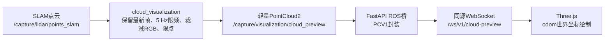

# SLAM 点云网页实时预览首版方案

> 文档性质：历史设计或历史测试记录。当前运行版网页预览已经改为补偿后的
> `/capture/lidar/points_compensated_enu` 局部东北天点云，并只保留三维视图。
> 本文中的 SLAM 输入、RGB 裁减、世界坐标和俯视图结论不作为当前版本验收依据。


文档状态：首版端到端已实现并完成雷达与实际浏览器短时实机验证

> 2026-08-03修订：实机确认厂商SLAM流在帧号不同步时存在秒级空窗，当前运行版
> 已改用约10.23 Hz稳定原始点云作为“当前帧预览”，坐标语义为传感器局部坐标。
> 本文以下SLAM世界点云内容仅保留为首版历史设计，不再代表当前部署配置；当前
> 契约以`cloud_visualization/README.md`和PCV1协议文档为准。

适用平台：RK3588、Ubuntu 22.04、ROS 2 Humble、ODIN1 Lite

关联文档：

- [数据流设计](数据流设计.md)
- [ROS 2架构](ROS2架构.md)
- [PCV1点云预览协议](../interfaces/PCV1点云预览协议.md)
- [2026-07-31实机专项测试](../testing/ODIN1Lite_SLAM点云网页预览专项测试_2026-07-31.md)
- [cloud_visualization首版实机测试](../testing/cloud_visualization首版实机测试_2026-07-31.md)
- [浏览器点云预览端到端实机测试](../testing/浏览器点云预览端到端实机测试_2026-07-31.md)

## 1. 首版目标

首版在浏览器采集首页显示与当前RViz语义一致的SLAM世界点云，用于确认雷达、
SLAM和网页预览链路是否正常。

首版只实现：

1. 订阅SLAM点云；
2. 约10 Hz输入限频为5 Hz输出；
3. 将每点 `x/y/z/rgb` 裁减为 `x/y/z`；
4. 超过10,000点时做确定性等间隔限点；
5. 发布轻量ROS 2预览Topic；
6. FastAPI封装PCV1二进制帧并通过WebSocket转发；
7. Three.js按SLAM `odom` 世界坐标绘制三维视图和俯视图。

首版明确不实现：

- PointCloud2布局检查；
- 无效点、NaN、Inf和零点过滤；
- 点云与里程计时间戳配对；
- `odom`到`base_link`坐标转换；
- 车辆局部ROI或其他空间裁剪；
- 体素降采样；
- 点云原始RGB显示或高度着色；
- 断面提取、净空计算、点云记录和任务状态判断。

预览链路可以丢帧、暂停或断开。任何预览故障都不得反压或停止核心采集、运动
补偿、净空计算和记录。

## 2. 实测输入契约

2026-07-31对当前设备静止短时实测：

| 项目 | 实测值 |
| --- | --- |
| Topic | `/capture/lidar/points_slam` |
| 消息 | `sensor_msgs/PointCloud2` |
| 坐标系 | `device0/odom` |
| 字段 | x/y/z/rgb FLOAT32，偏移0/4/8/12 |
| 点步长 | 16字节/点 |
| 消息组织 | `height=1` |
| 大小端 | Little Endian |
| 点数 | 9,968～10,103，平均10,042 |
| 频率 | 约10.27 Hz |
| 带宽 | 约1.67 MB/s |
| 时间戳 | 设备启动时间，不是Unix时间 |

首版将上述实测布局作为固定前置契约，不在 `cloud_visualization` 内重复检查字段、
偏移、步长、大小端、行长度、数据长度或 `frame_id`。如果厂商固件、驱动或
适配层改变消息布局，必须先更新本契约和实现，不能声称首版能够自动兼容。

取消布局检查是首版有意接受的范围限制，不表示布局检查没有工程价值。后续需要
兼容多型号、多固件或不可信输入时，再单独评审增加。

## 3. 坐标语义

当前RViz配置满足：

```text
SLAM点云frame_id = device0/odom
RViz Fixed Frame = device0/odom
```

因此当前RViz显示这条点云时不需要进行有意义的坐标数值转换。首版浏览器复现
这种显示语义：

- 点坐标数值保持不变；
- 输出 `header.frame_id` 原样保留输入值；
- Three.js场景把该frame视为SLAM世界坐标；
- 页面显示实际 `frame_id`，不写死 `device0/odom`；
- 页面不得把它标为“车辆坐标系”；
- 未经动态实测，不显示“X向前、Y向左、Z向上”结论。

因为首版不转换到 `base_link`，所以不需要订阅里程计，也不需要时间戳配对。
车辆中心视图和车辆模型叠加属于后续独立功能。

Three.js默认Y轴向上，而ROS通常以Z轴向上。首版不交换点的XYZ数据，只设置相机
的向上方向为Z轴，并把网格放在XY平面。这是渲染场景设置，不是ROS坐标系转换。

## 4. 总体架构



所有连接保持从ROS到浏览器的单向数据流。`cloud_visualization`不监听网络端口，
浏览器不直接连接ROS 2。

## 5. ROS 2预览节点

本节已按首版设计实现，并于2026-07-31完成编译、单元测试和静止场景短时实机
验证。后端和浏览器尚未接入，不得据此声称网页预览已经完成。

### 5.1 文件结构

```text
ros2_ws/src/cloud_visualization/                         # ROS 2网页预览点云处理包根目录
├── CMakeLists.txt                                       # CMake构建、安装和测试目标定义
├── package.xml                                          # ROS 2包元数据与依赖声明
├── README.md                                            # 包职责、参数、Topic和运行说明
├── include/cloud_visualization/                         # 可独立测试的公开C++接口目录
│   └── cloud_preview_converter.hpp                      # 字段裁减和确定性限点接口
├── src/                                                 # ROS节点与转换逻辑实现目录
│   ├── cloud_visualization_node.cpp                     # 订阅、限频、发布和参数管理节点
│   └── cloud_preview_converter.cpp                      # xyz提取和等间隔限点实现
├── config/                                              # ROS节点默认配置目录
│   └── cloud_visualization.yaml                         # Topic、频率和最大点数参数
└── test/                                                # C++自动化测试目录
    └── test_cloud_preview_converter.cpp                 # 字段裁减和限点边界测试
```

必要注释统一使用中文，重点解释固定输入契约、限频覆盖、等间隔选点、设备时间戳
和预览链路隔离。

首版不引入PCL，运行依赖仅为 `rclcpp` 和 `sensor_msgs`。

### 5.2 Topic契约

| 方向 | Topic | 类型 | QoS |
| --- | --- | --- | --- |
| 输入 | `/capture/lidar/points_slam` | `sensor_msgs/PointCloud2` | Best Effort、Volatile、Keep Last 1 |
| 输出 | `/capture/visualization/cloud_preview` | `sensor_msgs/PointCloud2` | Best Effort、Volatile、Keep Last 1 |

输入发布端实测为Reliable。预览订阅请求Best Effort与其兼容，使预览拥塞时允许
丢弃，不要求发布端补发历史帧。

输出固定布局：

| 字段 | datatype | offset | count |
| --- | --- | ---: | ---: |
| x | FLOAT32 | 0 | 1 |
| y | FLOAT32 | 4 | 1 |
| z | FLOAT32 | 8 | 1 |

输出同时满足：

```text
height = 1
point_step = 12
row_step = width × 12
is_bigendian = false
width <= 10000
```

输出 `header.stamp`、`header.frame_id` 和 `is_dense` 原样继承输入消息。节点不把
未经检查或过滤的输出强行标为 `is_dense=true`。

### 5.3 调度和限频

订阅回调只保存最新点云共享指针和内部接收序号，不遍历点云。5 Hz墙钟定时器
只消费最新且尚未处理的消息：

```text
点云约10 Hz到达
→ 最新消息覆盖尚未处理的旧消息
→ 5 Hz定时器取走最新消息
→ 裁减字段并限制点数
→ 发布一次
```

没有新点云时不重复发布上一帧。输出没有订阅者时可以跳过转换，但仍允许更新
“是否收到输入”的简单状态。

首版使用 `SingleThreadedExecutor`。如果以后组合进多线程执行器，必须再增加
共享指针同步并补充并发测试。

### 5.4 字段裁减

输入固定为每点16字节：

```text
x FLOAT32：offset 0
y FLOAT32：offset 4
z FLOAT32：offset 8
rgb FLOAT32：offset 12
```

输出每点只保留前12字节的XYZ。由于RGB在每个点内部交错，不能把整段输入数据
直接截短；实现按选中的输入点逐点复制12字节，但不把字节解析成浮点数，也不
检查坐标数值。

### 5.5 最大点数限制

当输入点数不超过 `max_points` 时保留全部点。超过上限时使用确定性等间隔选点：

```text
input_index = floor(output_index × input_count / output_count)
```

默认 `output_count=10000`。该操作只控制协议和带宽上限，不分析空间密度，不是
体素降采样，也不是ROI。

不得简单截取前N点，以免持续丢失扫描序列尾部区域。相同输入和参数必须得到相同
输出。

### 5.6 参数

| 参数 | 单位 | 初值 | 合法范围 | 失效行为 |
| --- | --- | ---: | --- | --- |
| `enabled` | bool | true | true/false | false时停止发布 |
| `input_topic` | string | `/capture/lidar/points_slam` | 非空 | 启动失败 |
| `output_topic` | string | `/capture/visualization/cloud_preview` | 非空 | 启动失败 |
| `publish_rate_hz` | Hz | 5.0 | 1.0～10.0 | 启动失败 |
| `max_points` | 点 | 10000 | 500～20000 | 启动失败 |

参数校验只针对节点自身配置，不属于PointCloud2输入布局检查。

## 6. FastAPI ROS桥

本节已按首版设计实现，并于2026-07-31完成PCV1、同源WebSocket、四客户端和
雷达端到端短时实机验证。

### 6.1 文件结构

```text
backend/                                             # FastAPI后端源码和测试根目录
├── main.py                                          # 应用生命周期、路由注册和静态页面挂载
├── ros_bridge/                                      # ROS 2桥接线程目录
│   ├── __init__.py                                  # ROS桥Python包初始化文件
│   └── cloud_preview_bridge.py                      # 订阅预览Topic并提交到异步事件循环
├── protocols/                                       # 浏览器传输协议目录
│   ├── __init__.py                                  # 协议Python包初始化文件
│   └── cloud_preview_v1.py                          # PCV1二进制帧封装实现
├── websocket/                                       # WebSocket连接管理目录
│   ├── __init__.py                                  # WebSocket包初始化文件
│   ├── routes.py                                    # 点云WebSocket路由定义
│   └── cloud_preview_hub.py                         # 每客户端最新帧队列管理
└── tests/                                           # 后端自动化测试目录
    ├── test_cloud_preview_protocol.py               # PCV1帧头和边界测试
    ├── test_cloud_preview_hub.py                    # 最新帧覆盖和连接状态测试
    └── test_cloud_preview_websocket.py              # 连接、断开和慢客户端测试
```

### 6.2 生命周期和线程

Uvicorn只运行一个worker。ROS桥使用专用 `rclpy.Context` 和后台
`SingleThreadedExecutor`：

```text
ROS后台线程收到预览PointCloud2
→ 生成PCV1固定头
→ 连接msg.data形成一份二进制帧
→ 安全提交到FastAPI asyncio事件循环
```

ROS回调不等待WebSocket。ROS初始化失败时，FastAPI仍提供静态页面和健康接口，
页面显示“ROS桥不可用”。

### 6.3 转发边界

FastAPI同样不做PointCloud2布局检查、逐点解析、坐标转换、过滤、抽样或修复。
它依赖ROS预览Topic严格遵守本设计固定输出契约，只读取：

- `header.stamp`；
- `header.frame_id`；
- `width`；
- `data`。

这里的“原样转发”表示不处理XYZ负载，不承诺Python与WebSocket栈完全零复制。

### 6.4 客户端背压

每个客户端拥有容量为1的asyncio队列。新帧到达而队列已有旧帧时，删除旧帧并
放入新帧。

首版限制：

| 项目 | 初值 |
| --- | ---: |
| 最大客户端数 | 4 |
| 单客户端队列 | 1帧 |
| 单帧上限 | 128 KiB |
| 单次发送超时 | 500 ms |

客户端断开只清理自身会话，不改变ROS节点、雷达或任务状态。

## 7. Three.js前端

本节已按首版设计实现，并于2026-07-31使用实际Chromium和当前雷达点云完成
三维画布渲染验证。

### 7.1 文件结构

```text
frontend/                                               # 浏览器界面和前端测试根目录
├── app/                                                # Next.js页面目录
│   └── page.tsx                                        # 采集首页和点云查看器接入入口
├── components/                                         # 可复用界面组件目录
│   └── point-cloud/                                    # 点云预览组件目录
│       ├── PointCloudViewer.tsx                        # Three.js场景、相机和GPU缓冲管理
│       ├── cloudPreviewProtocol.ts                     # PCV1文本和二进制帧解析
│       └── useCloudPreviewSocket.ts                    # WebSocket连接、重连和清理
└── tests/                                              # 前端协议和连接测试目录
    └── cloud-preview-protocol.test.mjs                 # PCV1帧头、边界和页面装配测试
```

直接使用锁定版本的Three.js，不引入React Three Fiber，不实现自定义高度着色
Shader。

### 7.2 GPU资源

组件初始化一次：

- `WebGLRenderer`；
- `Scene`；
- 透视和正交相机；
- 容量10,000点的Float32位置缓冲；
- `BufferGeometry`；
- 单色 `PointsMaterial`；
- `Points`、网格、坐标轴和轨道控制器。

每个合法PCV1帧只把XYZ负载复制到预分配位置缓冲，更新绘制范围并请求绘制。
组件卸载时关闭WebSocket、取消定时器和动画帧，并释放Three.js资源。

### 7.3 显示模式和文案

| 模式 | 首版行为 |
| --- | --- |
| 三维视图 | 透视相机、轨道旋转、平移和缩放 |
| 俯视图 | 正交相机沿SLAM坐标Z轴向下 |
| 断面视图 | 显示尚未接入，不用SLAM点云伪造断面 |

正常状态栏示例：

```text
10,000点 · 接收5.0 FPS · frame: device0/odom · 序号连续
```

页面底部应显示“SLAM世界坐标系”和实际 `frame_id`，删除当前静态页面中的
“车辆坐标系：X向前·Y向左·Z向上”表述。

## 8. PCV1和带宽

PCV1使用24字节固定头，后接连续XYZ FLOAT32 Little Endian负载。坐标模式为
`slam_odom`，车辆局部坐标标志不置位。

最大帧大小：

```text
24 + 10000 × 12 = 120024 bytes
```

5 Hz时单客户端点云数据约0.60 MB/s，四个客户端约2.40 MB/s，不含少量
WebSocket和TCP开销。首版不做体素降采样，因此实测时应按接近最大带宽评估。

设备时间戳原样进入PCV1，仅用于顺序和同一设备时间域关联。浏览器不得使用
`Date.now() - sensor_stamp_ns` 计算端到端延迟。

## 9. 启动集成

需要同步修改：

- `bringup`：启动 `cloud_visualization_node`；
- `bringup/config/qos.yaml`：登记预览Best Effort QoS；
- `backend/main.py`：在静态文件挂载前注册WebSocket路由并管理ROS桥生命周期；
- `scripts/operation/run_web.sh`：加载ROS和两个工作空间；
- `frontend/package.json`：锁定Three.js依赖；
- 页面文案：把车辆局部坐标改为SLAM世界坐标。

Web启动脚本必须依次加载ROS 2、厂商驱动和业务工作空间环境。systemd统一调用
项目启动脚本，不绕过ROS环境直接运行Uvicorn。

## 10. 自动化测试

ROS转换测试覆盖：

1. 当前实测固定布局的 `xyzrgb` 输入裁减为 `xyz`；
2. 输入少于、等于和超过10,000点；
3. 超限时等间隔选点；
4. 时间戳、`frame_id` 和 `is_dense` 原样保留；
5. 同样输入和参数得到同样输出。

测试不覆盖布局错误、大小端变化、字段缺失、NaN、Inf、零点、位姿配对、坐标
转换、ROI或体素，因为这些均不属于首版功能。

后端测试覆盖PCV1封装、每客户端最新帧、慢客户端隔离、断开清理和ROS不可用
状态。前端测试覆盖PCV1解析、超限和截断帧拒绝、重连、资源释放以及三维/俯视
切换。

前端仍必须检查PCV1网络帧的magic、版本、点数和总长度。这里检查的是浏览器协议
边界，不是ROS PointCloud2布局检查。

## 11. 实机验收

首版完成后按以下顺序验证：

1. 单独启动雷达和预览节点，确认输出约5 Hz且每帧不超过10,000点；
2. RViz固定在输入点云实际 `frame_id`，与浏览器对比空间形状；
3. 确认浏览器显示实际SLAM世界frame，不显示车辆局部轴向结论；
4. 同时打开四个浏览器客户端，验证四者都只显示最新帧，第五个连接被拒绝；
5. 制造慢连接和断开，确认ROS预览节点与核心采集继续运行；
6. 在RK3588上记录CPU、内存、WebSocket带宽、覆盖帧数和处理耗时；
7. 连续运行至少30分钟，检查内存增长、网络错误和预览恢复。

完成标准：

| 验收项 | 首版标准 |
| --- | --- |
| 输出频率 | 目标5 Hz，允许跳过中间帧 |
| 输出点数 | 不超过10,000 |
| 输出布局 | xyz FLOAT32，12字节/点 |
| 坐标系 | 与输入SLAM点云一致 |
| 浏览器效果 | 与RViz使用同一Fixed Frame时空间形状基本一致 |
| 页面断开 | ROS预览和核心采集继续运行 |
| 连续运行 | 30分钟无持续内存增长 |

静止室内测试不能证明动态车辆、隧道场景、坐标轴方向或RK3588满负载性能。
实机验收后应新增带日期的测试记录，不覆盖既有原始测试事实。
