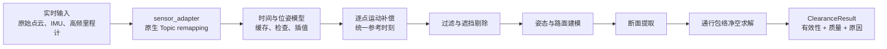
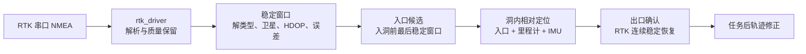
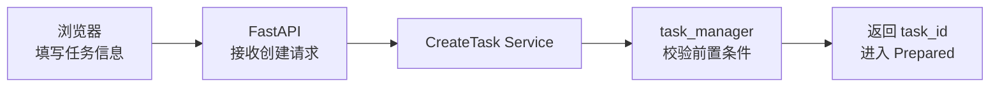
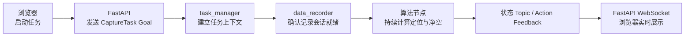
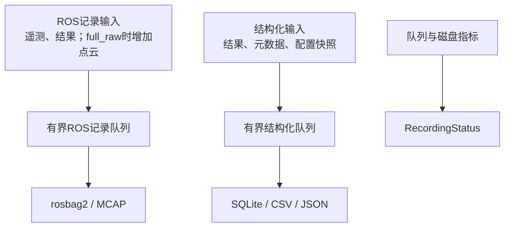

# 数据流设计

文档状态：设计基线

关联文档：[系统总体架构](system_architecture.md)、
[ROS 2 架构](ros2_architecture.md)

## 1. 数据流分类

系统的数据流分为六类：

1. 核心实时测量流；
2. RTK 与洞内定位流；
3. 任务控制流；
4. 记录与回放流；
5. 浏览器预览流；
6. 诊断与降级流。

只有前两类参与当前净空计算。记录、预览和浏览器控制均不得成为核心数据回调的
同步依赖。

## 2. 核心实时测量流



### 2.1 点云接入

`sensor_adapter` 只改变 Topic 名称，不读取或复制消息。以下最低限度校验由
`motion_compensation` 的输入边界承担：

- 消息时间戳存在且未发生不可解释跳变；
- `PointCloud2` 行步长、点步长和数据长度一致；
- x/y/z、置信度和 `offset_time` 字段存在且类型正确；
- 非有限点和全零点比例可统计；
- 消息仍来自启动配置指定的设备；
- `frame_id` 和坐标语义已经过实测确认。

校验失败的帧进入诊断和记录，但不进入净空求解。

### 2.2 位姿缓存

IMU 和高频里程计按采集时间进入有界缓存。缓存必须支持：

- 严格时间排序或明确拒绝过度乱序样本；
- 查询点云所有逐点时刻的覆盖范围；
- 平移插值和旋转插值；
- 最大插值间隔限制；
- 缓存边界、重复时间和时间跳变诊断。

缓存长度由“点云最大延迟 + 单帧时长 + 调度抖动 + 安全裕量”计算，不能无限增长。

### 2.3 逐点运动补偿

对原始点 \(p_i\)，其采集时刻为：

```text
t_i = cloud_time_origin + offset_time_i
```

查询对应位姿并将其转换到统一参考时刻 `t_ref`。`t_ref` 可选择帧首、帧尾或帧中，
但必须配置化、写入输出语义并在固定数据集上保持一致。

以下任一情况发生时，当前帧不得假装完成补偿：

- `offset_time` 缺失或单位未确认；
- 点时刻超出位姿缓存覆盖；
- 插值间隔超过阈值；
- 位姿发生跳变或含非有限值；
- 外参缺失或版本不匹配。

输出同时携带质量统计，例如补偿点比例、最大插值间隔和无效原因。

### 2.4 净空计算

补偿点云依次经过：

1. 无效点、零点、非有限点和低置信度点过滤；
2. 车辆本体和固定安装结构遮挡剔除；
3. 变换到 `base_link` 并结合重力方向；
4. 路面候选提取和路面模型质量评估；
5. 按里程/参考位置提取断面；
6. 在配置的通行包络内寻找最低顶部障碍；
7. 生成当前净空、累计最小净空和质量指标。

当前结果和累计结果是不同字段。当前帧无效时，累计最小值可以作为任务历史保留，
但不能显示成当前帧测量值。

## 3. RTK 与定位流



入口不是单个最后 fix，而是进入隧道前满足阈值的一段稳定窗口。出口也不是首次
出现高质量 fix，而是连续稳定恢复后的确认结果。

洞内实时里程必须标记来源和质量。已观测到 ODIN1 Lite 里程计约 14.3% 尺度低估及
姿态漂移，因此：

- 实时里程不能标记为已校准精确桩号；
- 不能用全零协方差表示零误差；
- 出口 RTK 约束后的修正轨迹与实时轨迹分别保存；
- 人工入口/出口标记必须进入事件流，不能直接篡改历史样本。

## 4. 任务控制流

任务控制按“创建、运行、结束”三个阶段拆开表达。每张图只保留一条从左到右的
主链路，节点下方的说明表负责补充条件和异常行为。

### 4.1 创建与校验



创建阶段由 `task_manager` 统一校验，后端不复制这些规则。前置条件至少包括：

- 必需传感器在线；
- 点云字段和时间模型已验证；
- 配置及标定可加载；
- 记录目录可创建且磁盘空间满足阈值；
- 不存在冲突的活动任务；
- 核心节点健康。

任何一项不满足时，任务停留在非运行状态，并返回明确的失败项；不得创建一个
表面成功但无法启动的任务上下文。

### 4.2 启动与持续运行



运行期间各模块保持单向职责：

| 模块 | 输入 | 输出 | 不承担的职责 |
|---|---|---|---|
| `task_manager` | Goal、传感器及节点状态 | 任务状态、Action Feedback | 不执行净空算法 |
| `data_recorder` | 任务状态、结构化结果 | 会话就绪、队列及记录状态 | 不决定任务状态 |
| 定位与净空节点 | 标准化传感器数据、任务上下文 | 定位和净空结果 | 不直接控制浏览器 |
| FastAPI | ROS 状态与结果 | HTTP、WebSocket 数据 | 不复制设备端状态机 |

若浏览器在 Goal 已接受后断开，Action 和设备端任务继续。浏览器重连后通过
transient 状态 Topic 和后端查询恢复展示。

### 4.3 停止与安全收尾


| 收尾情况 | `task_manager` 行为 | 最终状态 |
|---|---|---|
| 队列在期限内完成 | 保存诊断摘要和最终结果 | `Completed` |
| 队列超时但核心结果完整 | 标记记录不完整并明确告警 | `Completed`（带告警） |
| 核心结果或元数据无法完成 | 保存可恢复信息和失败原因 | `Faulted` |
| 浏览器在收尾期间断开 | 设备端继续执行，不等待浏览器 | 按实际收尾结果确定 |

## 5. 记录流



### 5.1 记录策略

当前无独立 SSD/NVMe，默认 `telemetry_only`：

- IMU 和高频里程计；
- RTK fix 和完整质量状态；
- TF/static TF；
- 运动补偿、定位和净空输出；
- 任务事件和诊断。

该策略明确不保存标准化原始点云、厂商原始点云或补偿点云，所以不能从任务文件
重放运动补偿和净空算法。算法回放必须使用另行准备的固定原始点云数据集。

后续独立数据盘就绪后启用 `full_raw`，增加标准化原始点云及逐点时间。是否同时
保存厂商原始 Topic 再由存储预算和故障分析需求决定。

### 5.2 写盘约束

- ROS 回调只入有界队列，不同步执行大文件写入；
- 队列水位、写入延迟、吞吐和丢弃数持续监控；
- 元数据使用临时状态和原子完成标记，区分进行中、完整和异常终止任务；
- 设备掉电后能够识别未正常结束的任务；
- 磁盘不足策略必须在任务开始前配置并保存快照；
- 不创建逐帧 PCD 小文件。

## 6. 浏览器预览流


预览链路与测量链路使用独立队列。建议按以下顺序降级：

1. 降低点云预览频率；
2. 增大体素尺寸或缩小 ROI；
3. 暂停点云预览，仅保留状态和净空数值；
4. 保持核心采集、计算和记录。

`cloud_visualization` 不监听外部端口。FastAPI 负责客户端数量、消息版本、限流和
断线；浏览器不订阅 ROS 2，也不接收原始全分辨率点云。

## 7. 诊断与降级流


诊断至少分为：

- `OK`：满足当前功能要求；
- `WARN`：功能可继续但质量下降；
- `ERROR`：当前结果无效或子功能不可用；
- `STALE`：超过预期更新时间。

任务管理器根据配置把诊断映射为“继续、降级、拒绝启动、安全结束”。映射结果和
触发原因必须形成任务事件。`system_monitor` 只提供事实和严重度，不直接改写
任务状态。

## 8. 背压和资源隔离

每条流都必须定义拥塞时行为：

| 链路 | 拥塞策略 |
| --- | --- |
| 原始点云→运动补偿 | 有界队列；丢弃过期帧并记录，不积累秒级延迟 |
| 位姿→缓存 | 有界时间窗口；清理过期样本，拒绝异常乱序 |
| 补偿→净空 | 优先最新有效帧；不得复用上一帧结果冒充当前值 |
| 数据→记录 | 有界异步队列；按配置告警、降级或安全结束 |
| 点云→预览 | Keep Last 1；可随时丢弃 |
| ROS→Web 客户端 | 每客户端有界缓冲；慢客户端断开或跳帧 |

`telemetry_only` 下记录积压不影响实时点云计算；低带宽遥测仍应保证完整。
`full_raw` 启用后，是否允许丢弃原始数据必须由现场策略明确。若要求原始数据
完整，队列达到停止阈值时应安全结束任务，而不是静默丢弃。

## 9. 回放流


回放应绕过真实串口和厂商设备，但保留与现场相同的标准化业务 Topic、TF、QoS
和参数快照。比较内容不仅包括净空数值，还包括：

- 帧有效/无效判定；
- 无效原因；
- 入口和出口窗口；
- 时间覆盖和插值统计；
- 当前与累计最小净空；
- 处理延迟、队列水位和丢帧。

## 10. 数据追溯

在线处理期间，任何一个净空结果都应建立以下关联：

```text
任务 ID
→ 软件/配置/标定版本
→ 原始点云帧序号、时间戳和逐点时间摘要
→ 使用的位姿时间范围
→ 补偿质量
→ 定位与断面位置
→ 路面和顶部质量
→ 有效性、原因和最终数值
```

在 `telemetry_only` 下，原始点云本体不会落盘，只保存上述关联标识、质量摘要和
结果；因此这种追溯不能恢复原始点。`full_raw` 下关联键同时写入点云 MCAP 和
结构化结果。关联信息不能只存在日志文本中。
