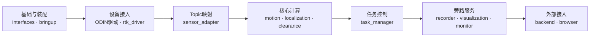
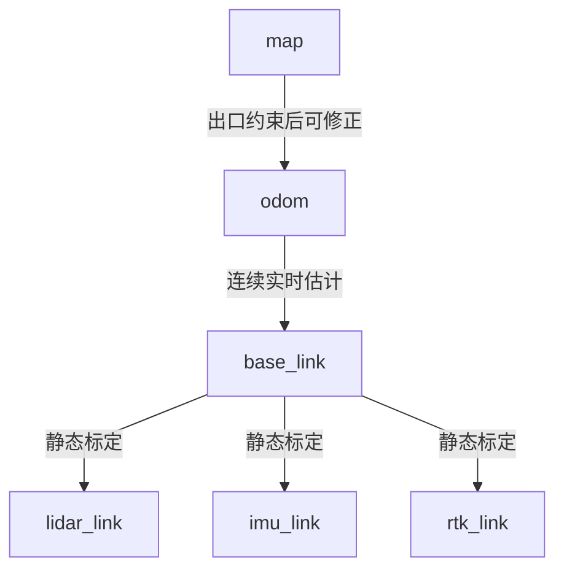

# ROS 2 架构

文档状态：设计基线

ROS 2 版本：Humble

命名空间：`/capture`

## 1. 设计原则

- 厂商驱动与业务工作空间分离。
- 厂商 Topic 只允许出现在驱动、`sensor_adapter` 配置和适配层测试中。
- 优先使用 `PointCloud2`、`Imu`、`NavSatFix`、`Odometry`、TF 和
  `DiagnosticArray`。
- 自定义接口只表达任务、质量、净空等标准消息无法完整表达的业务语义。
- 节点处理通信和参数，算法核心保持可独立单测。
- 高频链路使用有界队列；QoS、单位、坐标系和时间戳来源是接口的一部分。
- 控制使用 Service/Action，状态和数据使用 Topic，不用参数充当运行时消息总线。

本文中的自定义接口是拟定基线。首次实现前仍需确认字段、错误码、Web 序列化和
持久化映射。

实际设备是 ODIN1 Lite。厂商固件/SDK 2.0.2 上报的模型字符串为 `ODIN2`，
因此实测厂商前缀是 `/manifold/ODIN2/device0/`。该前缀只由
`sensor_adapter` Launch 参数持有，其他业务模块不引用厂商 Topic。

## 2. 包依赖关系



该图只表示由底层到上层的依赖方向，不展开多对多 Topic 连线。精确的生产者、
消费者和 QoS 由第4节的 Topic 表定义。跨包通信优先通过 ROS 2 接口；只有经过
性能验证的核心算法库才建立直接链接依赖。

## 3. 包和节点职责

| 包 | 主要节点 | 核心职责 | 明确不负责 |
| --- | --- | --- | --- |
| `interfaces` | 无 | 自定义 msg/srv/action | 算法、配置、业务逻辑 |
| `rtk_driver` | `rtk_driver_node` | 串口、NMEA、RTK 质量 | 进出洞状态机 |
| `sensor_adapter` | 无独立节点 | 原生 Topic remapping、雷达和 RViz2 启动 | 消息校验、frame 修改、运动补偿、净空 |
| `motion_compensation` | `motion_compensation_node` | 位姿缓存、插值、逐点去畸变 | 长期定位、路面求解 |
| `localization` | `localization_node` | RTK 稳定窗口、洞内里程、轨迹质量 | 任务生命周期 |
| `clearance_engine` | `clearance_node` | 过滤、路面、断面、净空、置信度 | 原始记录、Web 编码 |
| `task_manager` | `task_manager_node` | 任务与进出洞状态机 | 复制算法和后端状态 |
| `data_recorder` | `data_recorder_node` | MCAP、元数据、结果和队列 | 阻塞实时链路 |
| `cloud_visualization` | `cloud_visualization_node` | 预览限频、裁剪、降采样 | 外部 WebSocket 服务 |
| `system_monitor` | `system_monitor_node` | 资源、Topic、传感器和算法诊断 | 修改测量结果 |
| `bringup` | 无 | Launch、QoS、参数组合、回放入口 | 业务算法 |

## 4. Topic 设计

### 4.1 核心数据 Topic

| Topic | 类型 | 发布者 | 主要订阅者 | 坐标系/时间 | 典型频率 | QoS |
| --- | --- | --- | --- | --- | --- | --- |
| `/capture/lidar/points_raw` | `sensor_msgs/PointCloud2` | ODIN 驱动（经 remap） | `motion_compensation`；full_raw 时 recorder | 保留厂商 `frame_id` 和设备时间，保留 `offset_time` | 实测约 10.23 Hz | 继承厂商驱动，当前 Reliable/Volatile |
| `/capture/lidar/points_slam` | `sensor_msgs/PointCloud2` | ODIN 驱动（经 remap） | RViz2、辅助诊断 | 保留厂商坐标与设备时间；不得作为核心净空输入 | 实测约 10.3 Hz | 继承厂商驱动，当前 Reliable/Volatile |
| `/capture/imu/data` | `sensor_msgs/Imu` | ODIN 驱动（经 remap） | `motion_compensation`, `localization`, recorder | 保留厂商 `frame_id` 和设备时间 | 实测约 401 Hz | 继承厂商驱动，当前 Reliable/Volatile |
| `/capture/odometry/high_rate` | `nav_msgs/Odometry` | ODIN 驱动（经 remap） | `motion_compensation`, `localization`, recorder | 保留厂商父子 frame 和设备时间 | 实测约 401 Hz | 继承厂商驱动，当前 Reliable/Volatile |
| `/capture/odometry/slam` | `nav_msgs/Odometry` | ODIN 驱动（经 remap） | `localization`, preview, recorder | 保留厂商父子 frame 和设备时间 | 实测约 10 Hz | 继承厂商驱动，当前 Reliable/Volatile |
| `/capture/rtk/fix` | `sensor_msgs/NavSatFix` | `rtk_driver` | `localization`, recorder | WGS84；GNSS 时间或明确标记的接收时间 | 1–20 Hz | `reliable_state` |
| `/capture/rtk/status` | `interfaces/msg/RtkStatus` | `rtk_driver` | `localization`, task, monitor, recorder | 与 fix 同一采样时刻 | 1–20 Hz | `reliable_state` |
| `/capture/lidar/points_compensated` | `sensor_msgs/PointCloud2` | `motion_compensation` | `clearance_engine`, preview；full_raw 时 recorder | `base_link`；统一参考时刻 | 约 10 Hz | `sensor_data_bounded` |
| `/capture/localization/odometry` | `nav_msgs/Odometry` | `localization` | clearance, task, preview, recorder | `odom`→`base_link`；融合参考时刻 | 约 10–100 Hz | `reliable_bounded` |
| `/capture/localization/status` | `interfaces/msg/LocalizationStatus` | `localization` | task, clearance, monitor, recorder | 对应定位估计时刻 | 约 10 Hz | `reliable_state` |
| `/capture/clearance/result` | `interfaces/msg/ClearanceResult` | `clearance_engine` | task, recorder, monitor, backend | 关联点云参考时刻和断面位置 | 约 10 Hz | `reliable_bounded` |

实测原始点云为 49,152 点、18 字节/点；`offset_time` 是 FLOAT32 秒，按 32 个
采集组从 0 递增到约 0.094368 秒，组间约 0.003044 秒。厂商 header 使用
`device0/odom` 且时间从设备启动后约数百秒开始。remapping 不改变这些内容，
`motion_compensation` 等消费者必须验证坐标语义和时间原点，不能直接解释为
可信的 `lidar_link` 或系统墙钟。

### 4.2 状态、记录和预览 Topic

| Topic | 类型 | 发布者 | 说明 | QoS |
| --- | --- | --- | --- | --- |
| `/capture/task/status` | `interfaces/msg/TaskStatus` | `task_manager` | 当前任务唯一权威状态 | `transient_state` |
| `/capture/task/events` | 拟定 `interfaces/msg/TaskEvent` | `task_manager` | 状态迁移、人工标记和异常事件 | `reliable_bounded` |
| `/capture/recording/status` | 拟定 `interfaces/msg/RecordingStatus` | `data_recorder` | 队列、吞吐、丢弃、磁盘和会话状态 | `transient_state` |
| `/capture/visualization/cloud_preview` | `sensor_msgs/PointCloud2` | `cloud_visualization` | 已限频和降采样，仅供预览 | `preview_best_effort` |
| `/capture/diagnostics` | `diagnostic_msgs/DiagnosticArray` | `system_monitor` | 聚合传感器、算法和系统诊断 | `transient_state` |

若预览压缩后不再能用 `PointCloud2` 准确表达，才增加带协议版本的自定义消息。
不能为 Web 私有格式污染核心测量 Topic。

## 5. QoS 配置

建议在 `bringup/config/qos.yaml` 定义命名配置，而不是各节点复制数值：

| 配置名 | Reliability | Durability | History/Depth | 用途 |
| --- | --- | --- | --- | --- |
| `sensor_data_bounded` | Best Effort | Volatile | Keep Last，深度按延迟预算设置 | 原始点云、IMU、高频位姿 |
| `reliable_bounded` | Reliable | Volatile | Keep Last，有界 | 补偿结果、定位、净空 |
| `reliable_state` | Reliable | Volatile | Keep Last，小深度 | RTK fix/质量 |
| `transient_state` | Reliable | Transient Local | Keep Last 1–10 | 任务、记录、系统状态 |
| `preview_best_effort` | Best Effort | Volatile | Keep Last 1 | 浏览器预览 |

实际深度必须通过最坏处理延迟和内存预算计算。点云队列不能为了“不丢帧”无限
增大；过期帧对实时净空没有价值，应记录丢弃和延迟诊断。

## 6. Service 和 Action

### 6.1 任务 Action

`/capture/tasks/capture` 使用拟定的 `interfaces/action/CaptureTask`：

- Goal：任务 ID、配置快照 ID、启动模式；
- Feedback：任务状态、洞内里程、当前/累计最小净空、记录状态和告警摘要；
- Result：终止状态、入口/出口信息、累计结果、数据位置和诊断摘要；
- Cancel：安全停止并完成已有数据落盘，不删除任务。

长时间采集使用 Action，避免 `StartTask.srv` 和 Action 同时拥有任务生命周期。

### 6.2 短操作 Service

| Service | 类型 | 语义 |
| --- | --- | --- |
| `/capture/tasks/create` | `interfaces/srv/CreateTask` | 校验元数据和配置，创建不可冲突的任务 ID |
| `/capture/tasks/mark_boundary` | `interfaces/srv/MarkTunnelBoundary` | 人工标记入口或出口，记录操作者和时刻 |

读取状态使用 Topic 或后端查询，不额外设计轮询 Service。导出属于异步文件作业，
优先在 backend/tools 实现；系统复位属于运维高风险操作，不放进通用任务接口。

## 7. 自定义接口最小集合

首次实现建议只创建当前消费者确实需要的接口：

- `TaskStatus.msg`：任务 ID、状态枚举、状态进入时刻、质量和原因；
- `RtkStatus.msg`：解类型、卫星数、HDOP、误差指标、稳定性；
- `LocalizationStatus.msg`：实时里程、质量、RTK/里程计来源和修正状态；
- `ClearanceResult.msg`：当前净空、累计最小值、断面位置、有效性和质量指标；
- `CreateTask.srv`；
- `MarkTunnelBoundary.srv`；
- `CaptureTask.action`。

CPU、内存、磁盘和普通设备状态优先使用 `diagnostic_msgs`，不重复创建
`SystemStatus.msg`、`DeviceStatus.msg`。接口字段设计必须包含单位，并避免用
特殊浮点值代替明确的 `valid` 和原因枚举。

## 8. TF 与坐标系



- `base_link` 的轴向遵循 ROS REP-103：x 前、y 左、z 上。
- 传感器静态 TF 来自版本化标定，不来自未经验证的厂商 `frame_id`。
- 实时 `odom` 必须连续，不能因 RTK 恢复发生跳变。
- 全局修正通过 `map`→`odom` 或任务完成后的修正轨迹表达。
- `PointCloud2.header.stamp` 是该输出点云的统一参考时刻；逐点原始时间仍需在
  记录数据中保留。

## 9. 时间模型

系统区分至少三类时间：

1. 传感器采集时间：运动补偿和多传感器对齐的首选时间；
2. ROS 接收时间：诊断传输延迟，不可无说明替代采集时间；
3. 系统墙钟：文件、日志和用户展示。

每条传感器链路必须发布或记录：

- 时间源；
- 与 ROS 时钟的偏差和跳变；
- 消息乱序、重复和超时计数；
- 位姿缓存覆盖的最早/最晚时刻；
- 点云参考时刻选择策略。

回放 Launch 使用 ROS time，并验证算法没有偷用系统墙钟。

## 10. 参数与生命周期

影响测量语义的参数必须在任务启动前验证：

- 点云字段与逐点时间；
- 外参和轴向；
- 位姿缓存长度、最大插值间隔；
- RTK 稳定窗口和质量阈值；
- 车辆包络、遮挡区和净空定义；
- 路面/顶部质量阈值；
- 队列容量、磁盘阈值和预览限频。

第一阶段可以使用普通 `rclcpp::Node` 配合任务状态机；如果启动顺序和硬件就绪
控制复杂，再为驱动、适配、记录等引入 Lifecycle Node。不能同时存在 ROS
Lifecycle 状态和任务状态但没有明确映射。

## 11. Bringup

`bringup` 至少提供：

- `capture_system.launch.py`：设备正式运行；
- `replay.launch.py`：固定 MCAP 回放，启用 ROS time；
- `qos.yaml`：命名 QoS 配置；
- `development.yaml`：开发机安全参数；
- `production.yaml`：RK3588 生产参数；
- 静态 TF 和标定加载；
- 节点名称、命名空间及 Topic remap。

Launch 负责组装，不复制包内默认参数。生产配置中必须能关闭高负载预览而不影响
采集、运动补偿、净空和记录。

当前记录配置默认使用 `telemetry_only`，明确排除 raw/compensated cloud。
`full_raw` 保留为独立数据盘就绪后的配置，不允许仅因为 MCAP 插件已安装就自动
开始记录点云。

## 12. 接口变更检查

修改公共 Topic、TF 或自定义接口前，必须检查：

```text
发布者
  → 核心订阅者
  → task_manager
  → data_recorder / 回放
  → cloud_visualization
  → backend 序列化
  → frontend 展示
  → system_monitor
  → 固定数据集与集成测试
```

接口变更未同步记录和回放兼容策略时，不应合并。
