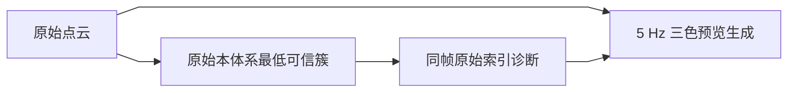
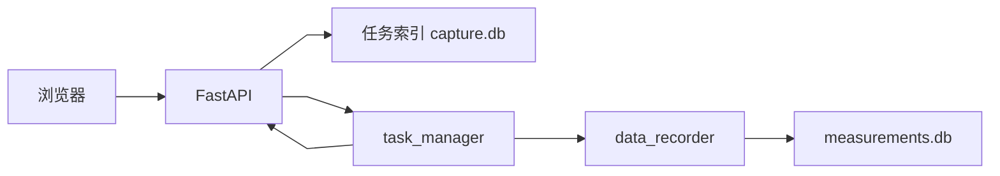

# 数据流设计

文档状态：当前数据流与后续目标并列

核对日期：2026-08-24

## 1. 当前实时点云流



原始点云同时供正式净空算法和网页预览旁路。两者都保持雷达 X-Y-Z；预览用精确源时间戳和
原始线性索引合并诊断分类，丢失时退全蓝。当前链路不进行旋转、平移或运动补偿，也不使用 SLAM 点云。

## 2. 网页展示流


点云、净空、RTK 和系统状态使用独立桥和独立 WebSocket。正式点云桥按浏览器连接数建立和释放 ROS subscription，
没有点云浏览器客户端时不维持 `/capture/visualization/cloud_preview` 消费者；development 原始点云桥同样按对应 WebSocket 客户端启停，
development telemetry 仅在显式调用 `/api/dev/overview` 时续租，停止调用约 3 s 后释放高频诊断订阅。当前单页测试界面直接复用 `/ws/v1/rtk` 和 `/ws/v1/clearance`，不调用 overview，因此普通打开测试页不会维持原始点云或高频里程计诊断订阅。网络慢客户端只丢旧展示数据，不反压 ROS 2 回调。

## 3. 当前 RTK 和地图流

```text
RTK 串口
→ rtk_driver
→ /capture/rtk/status + /capture/rtk/fix
→ FastAPI
→ /ws/v1/rtk
→ 原始RTK状态栏和蓝色高德地图轨迹
```

前端只做固定状态文字映射和 WGS84 到 GCJ-02 的地图转换，不判断稳定窗口和进出洞。

## 4. 当前任务控制与历史数据流

```text
创建、查询或逻辑删除任务
→ FastAPI HTTP
→ capture.db

开始、暂停、继续或停止
→ FastAPI HTTP
→ TaskControlBridge
→ task_manager ROS 2 Service
→ data_recorder
→ capture.db + tasks/<task_id>/measurements.db

选择有测量记录的任务
→ FastAPI HTTP
→ tasks/<task_id>/measurements.db
→ 完整高度曲线、统计和 RTK 端点

选择任务或创建日期后清理
→ FastAPI HTTP
→ 物理删除所选 tasks/<task_id>/
→ 保留 capture.db 中的 UUID、时间编号和清理记录
```

任务创建时生成稳定 UUID 和创建时间显示编号 `YYYYMMDD_HHMMSS`。同秒多任务追加
`_02`、`_03`。删除历史任务不会导致编号重排。设备端 `task_manager` 通过 Service 编排记录器，
并通过 `/capture/task/status` 发布可恢复状态。旧批次字段仅用于历史数据库兼容。

## 5. 当前任务控制流



浏览器断线后设备端任务继续。任务创建时中央数据库保存每个任务独立的计划行驶方向、左右车道、高度下限阈值和高度上限阈值；选择待执行任务时前端加载计划值，开始前允许现场覆盖。点击开始后，`task_manager` 将卡片当前值冻结为实际执行参数，并传给 `data_recorder`。开始采集前由 FastAPI 检查统一系统诊断，
只有雷达原始点云持续在线且 RTK 串口诊断正常时才允许进入任务状态机。入口和出口 RTK 只确认最近 2 s 内实际收到的有效 Fix；最后一个有效 Fix 超时后只保留为事件快照并标记无效，不写入 `rtk_endpoints`，未确认不阻塞已经开始的任务流程。

## 6. 当前净空流

```text
ClearanceResult
→ FastAPI JSON 快照
→ 顶部单值和最近 120 帧曲线
```

无效帧以 `null` 和无效原因传递，曲线断开。实时算法 WebSocket 仍输出原始 `lidar_to_top_m`；采集首页顶部显示和正式记录按当前任务参数叠加雷达安装高度。

## 7. 当前记录流

`data_recorder` 保存三组相关数据。`clearance_source_frames` 保留算法实际源帧；`clearance_samples`以50 Hz保存最近源帧保持序列，供实时曲线和历史回放；measurement schema v13新增`imu_samples`，每收到一帧IMU即快照最近净空、RTK、温度、原始雷达本体系最低点和ODIN原始里程计，非有限IMU分量写0而不丢弃该帧，作为38列“原始数据保存”TXT的数据源。`recording_metadata`保存实际行驶方向、左右车道和冻结高度参数。只根据可靠源序号或设备时间戳拒绝通信层重复源帧，不根据数值相同去重。暂停期间不写正式样本。

开始和停止分别保存入口、出口 RTK 事件快照。只有最近 2 s 内收到的有效 Fix 才写入已确认 `rtk_endpoints`；坐标无效、不存在或已超时时记录 `unconfirmed`，不等待人工确认。停止时完成 SQLite 完整性检查和原子文件重命名。

## 8. 报告流

报告页面显式提交所选任务 UUID 集合。TXT 只读取当前任务。原有PDF后端只汇总请求集合中满足正式
记录条件的任务，不依赖旧批次状态。大模型辅助PDF只读取当前单任务`measurements.db`，转换成一份
JSON后发起一次新的DeepSeek请求，不做分块或跨任务上下文复用。设备端先冻结最低净空、可信度和RTK
表格字段，模型按可编辑Skill返回紧凑审计JSON，PDF表格后只写报告分析结果和数据质量分析。API地址、
API Key、模型和Skill由显示端编辑并保存在设备runtime设置文件；作业结束后只清除作业索引中的Key副本。
PDF 和 TXT 文件名使用任务或报告生成时间编号。

## 9. 异常原则

- 原始点云时间、frame、布局或空间支持不足时净空输出无效；
- WebSocket 超时不得显示旧值为当前值；
- 浏览器断线不得停止设备端节点；
- 只有可靠源序号或设备时间戳相同时才拒绝通信层重复帧；相同测量值仍视为独立真实结果；
- RTK 端点未确认时保持空值和状态，不补造坐标。
