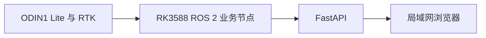
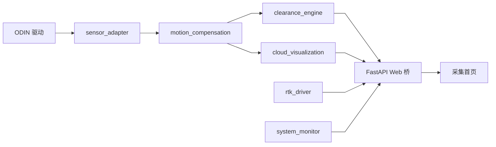

# 系统总体架构

文档状态：当前实现与目标架构并列

核对日期：2026-08-06

适用平台：RK3588、Ubuntu 22.04、ROS 2 Humble

## 1. 系统边界

设备端负责传感器接入、点云处理、算法和 Web 服务。浏览器负责显示和操作入口，
不得承担核心测量。浏览器关闭或网络中断不能影响 ROS 2 节点运行。

## 2. 当前已实现架构

当前网页预览输入是 `/capture/lidar/points_compensated_enu`，不是厂商 SLAM 点云。

## 3. 分层职责

### 3.1 设备接入

- 第三方 ODIN 驱动默认只读；
- `sensor_adapter` 只做 Topic remapping；
- `rtk_driver` 管理串口和 NMEA 解析；
- Web 后端不直接访问传感器。

实际设备为 ODIN1 Lite，SDK 2.0.2 上报模型字符串 `ODIN2`。厂商前缀只允许在
`sensor_adapter` 启动参数中出现。

### 3.2 实时测量

- `motion_compensation` 展开高频里程计时间戳并逐点补偿；
- `clearance_engine` 输出单帧最低合格近水平顶面距离；
- 当前没有路面模型、通行包络和任务累计净空。

### 3.3 旁路显示和诊断

- `cloud_visualization` 只做受控预览消息生成；
- `system_monitor` 只报告雷达、RTK、控制器和存储事实；
- FastAPI 使用有界最新值队列，不反压实时算法。

### 3.4 浏览器

采集首页已连接四路 WebSocket。任务创建、切换和控制按钮仍是浏览器内存原型。
数据回放和报告导出未连接正式任务数据。

## 4. 目标架构

后续需要增加：

`task_manager` 应成为任务状态唯一权威来源。`data_recorder` 应保存配置、标定、遥测、
结构化结果和诊断。两者当前均未实现。

## 5. 故障边界

| 异常 | 当前或目标行为 |
| --- | --- |
| 点云或位姿不足 | 当前帧无效或丢弃，不沿用旧值 |
| RTK 断开 | 状态灯变红，地图不增加轨迹 |
| 系统诊断超时 | 后端降级，前端清空旧快照 |
| 浏览器断开 | ROS 2 节点继续运行 |
| 预览变慢 | 最新帧覆盖旧帧，不阻塞测量 |
| 存储不足 | 当前仅告警；正式任务停止策略待任务管理实现 |

## 6. 测量边界

当前 `lidar_to_top_m` 不能直接用于最终工程净空判定。最终结果需要雷达安装高度、
路面基准、车辆姿态、通行包络和不确定度模型。
