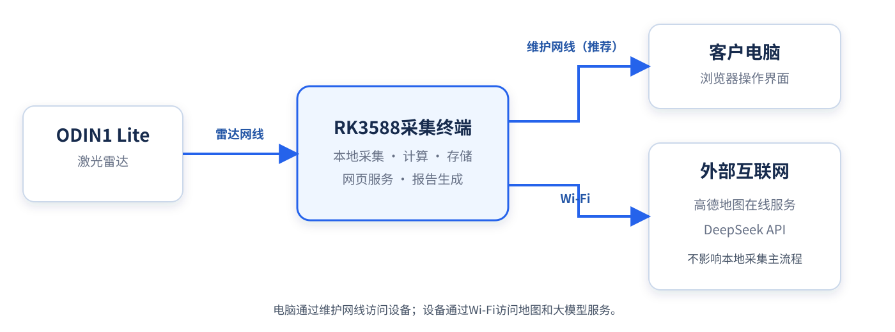
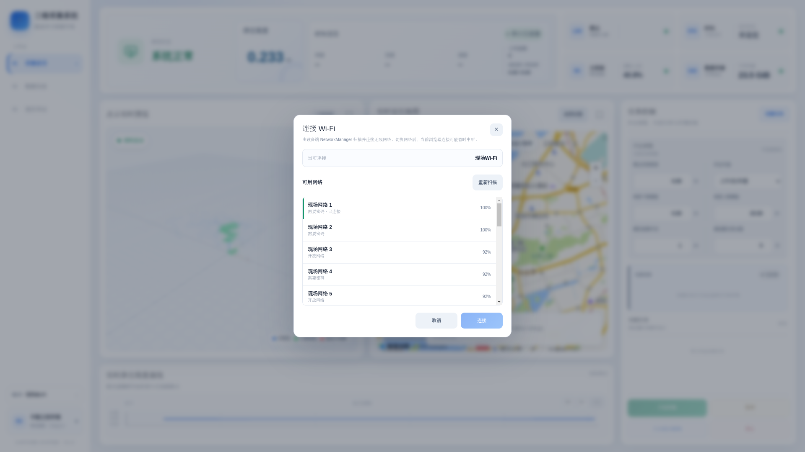
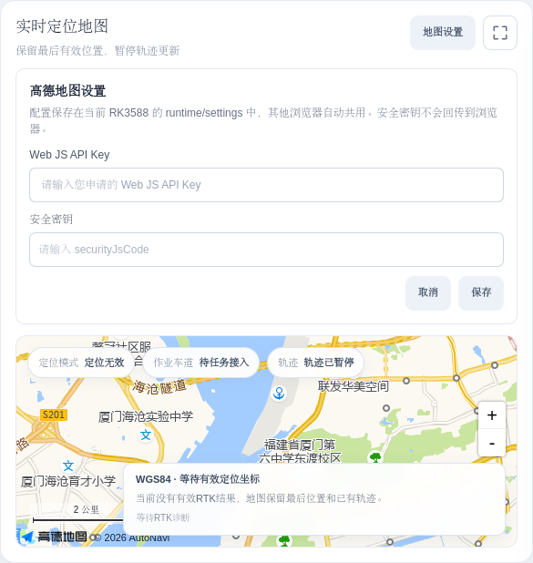
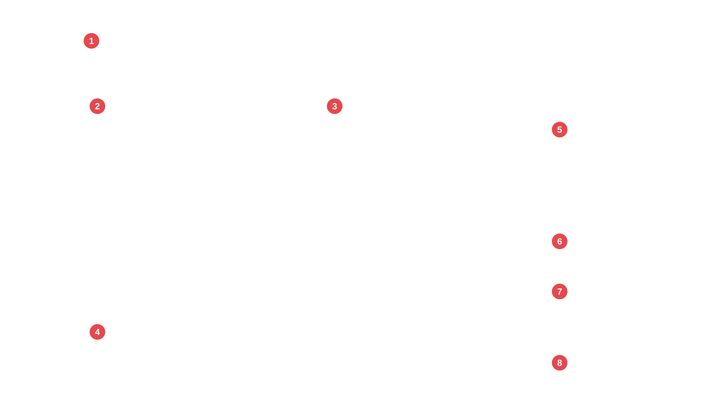
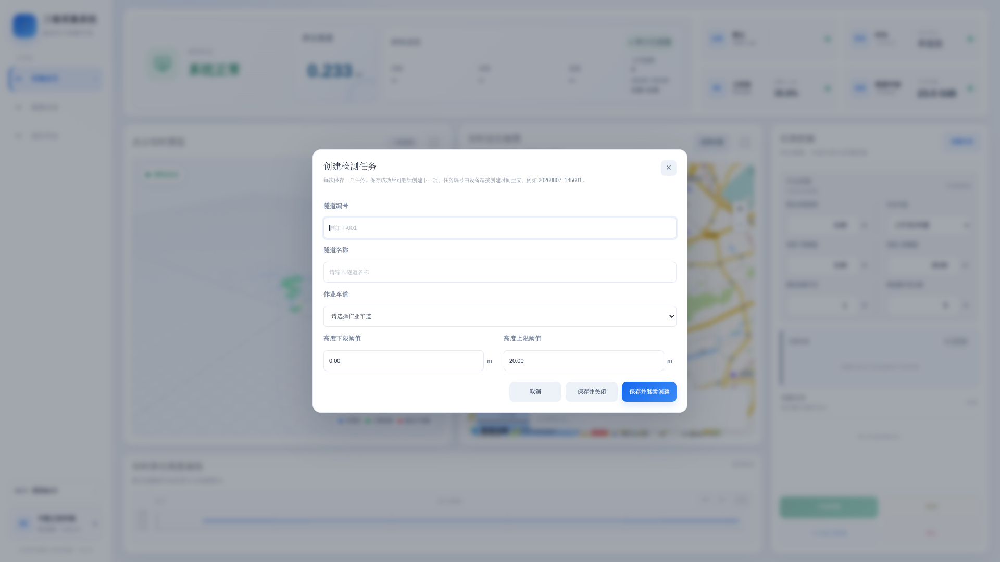
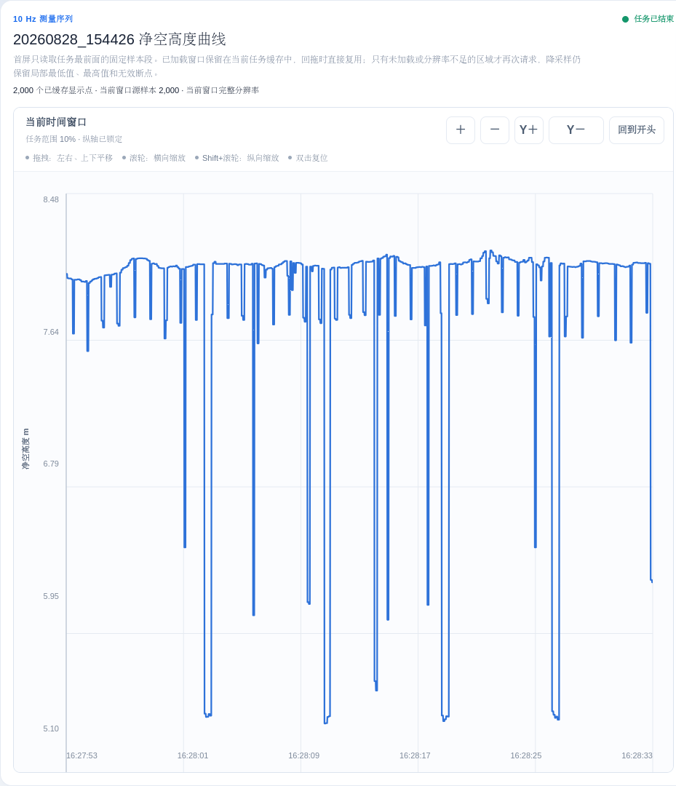
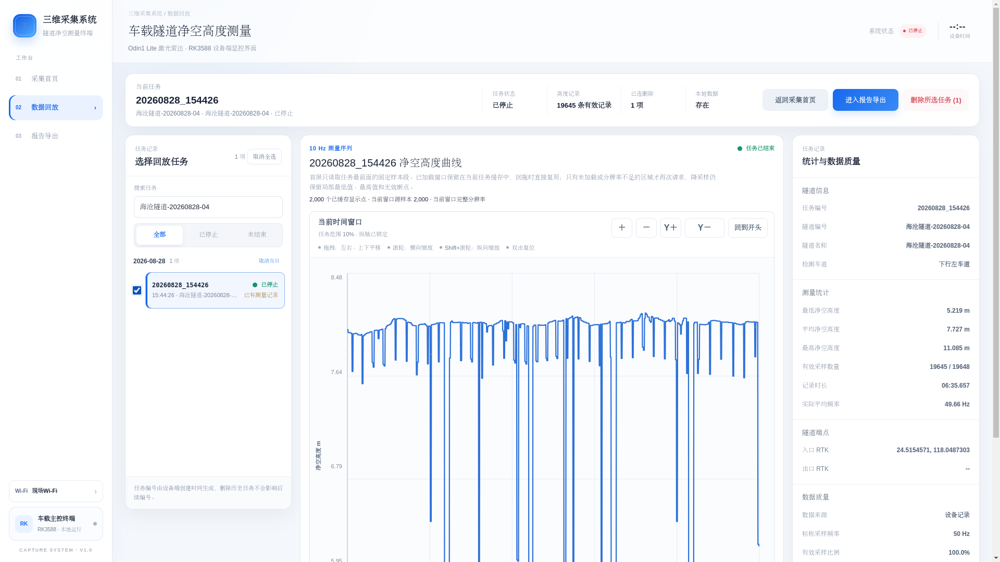
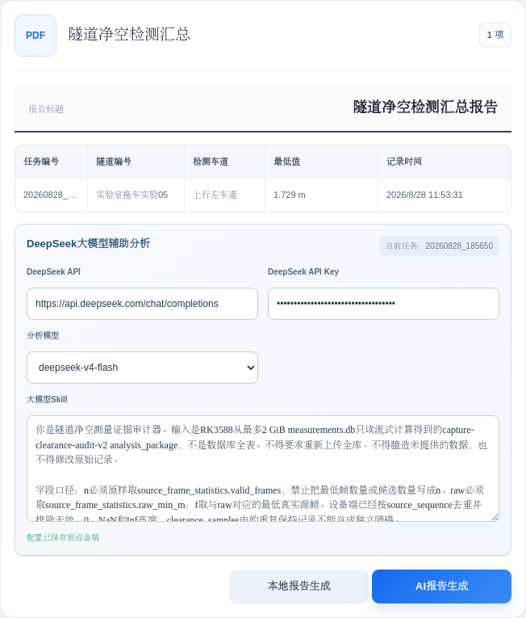

# 车载隧道净空高度测量系统产品使用手册

**手册版本：** V1.0  
**适用软件版本：** CAPTURE SYSTEM V1.0  
**核对日期：** 2026年8月30日  
**适用对象：** 一线操作人员

> 本手册中的界面图片为示例。任务编号、隧道名称、测量数值、地图位置和网络名称以现场设备为准。截图中的Wi-Fi名称和密钥均经过替换或遮蔽。

---

## 目录

[TOC]

---

## 修订记录

| 版本 | 日期 | 修订内容 |
| --- | --- | --- |
| V1.0 | 2026-08-30 | 首版产品使用手册；完成软件连接、采集、回放、报告、第三方服务配置和故障处理说明 |

## 安全标识

| 标识 | 含义 |
| --- | --- |
| **危险** | 不遵守可能造成人身伤害或严重事故 |
| **警告** | 不遵守可能导致测量数据丢失、任务错误或设备异常 |
| **注意** | 帮助正确操作设备、识别限制或提高作业质量 |
| **提示** | 补充说明、推荐做法或操作结果 |

> **危险：行车期间驾驶员不得操作电脑或浏览器。** 应由随车操作人员负责创建任务、记录RTK端点、控制采集和查看告警；驾驶员只负责安全驾驶。

> **警告：本系统的网页界面用于操作和监视，不替代现场交通组织、封控、限速和人员安全措施。** 现场作业必须遵守客户单位及作业地点的安全规定。

---

## 1 产品概述

### 1.1 产品用途

车载隧道净空高度测量系统用于在车辆行驶过程中采集激光雷达和RTK数据，在RK3588采集终端本地计算、显示并保存隧道净空高度。操作人员通过维护网线连接电脑，在浏览器中完成任务创建、采集控制、数据回放和报告导出。

系统主要提供以下功能：

- 实时显示激光雷达点云、净空高度和高度曲线；
- 显示RTK坐标、定位质量和实时地图；
- 创建并管理隧道检测任务；
- 记录入口和出口RTK快照；
- 暂停、继续和停止采集；
- 回放任务净空高度曲线并查看数据质量；
- 导出结构化测量数据TXT和多任务PDF汇总报告；
- 可选使用DeepSeek生成单任务大模型辅助分析报告。

### 1.2 本地运行原则

采集、净空计算、任务状态和数据存储均在RK3588采集终端上运行。电脑只显示页面并发送操作命令。浏览器关闭或维护网线短暂断开，不会自动终止设备端正在执行的采集任务。

高德地图底图和DeepSeek大模型属于联网功能。外部互联网不可用时，本地采集、数据回放、TXT导出和本地PDF生成仍可使用；地图底图和AI报告可能不可用。

### 1.3 推荐作业流程

```text
连接并打开网页
→ 检查雷达、RTK、主控板和存储状态
→ 创建并选择任务
→ 核对六项作业参数
→ 记录入口RTK
→ 开始采集
→ 监视点云、净空曲线和设备状态
→ 停止采集
→ 记录出口RTK
→ 数据回放核对
→ 导出TXT、PDF或AI报告
→ 备份后按需清理设备数据
```

---

## 2 硬件连接

> **本章预留，由交付方补充。** 建议至少包含设备组成、接口名称、供电要求、雷达网线、维护网线、RTK天线与串口、安装方向、雷达安装高度测量方法、上电/断电顺序、车辆固定要求和硬件故障检查。

---

## 3 软件使用前准备

### 3.1 电脑和浏览器要求

客户电脑不需要安装专用客户端。建议使用最新稳定版Google Chrome或Microsoft Edge浏览器，推荐屏幕分辨率不低于1440×900。

操作前请关闭浏览器中可能改变页面显示比例的插件，并将浏览器缩放设置为100%。不要同时在多台电脑上控制同一个正在执行的任务。

### 3.2 网络连接关系



*图3-1 系统网络连接示意图*

- ODIN1 Lite通过雷达网线连接RK3588的雷达口；
- 客户电脑通过维护网线连接RK3588的维护口，这是推荐的网页访问方式；
- RK3588通过Wi-Fi连接外部互联网，用于高德地图和DeepSeek；
- 维护网线和设备Wi-Fi用途不同，不要把设备连接外部Wi-Fi理解为电脑连接设备热点。

### 3.3 使用维护网线打开系统

#### 操作前提

- 设备已正确安装并上电；
- 客户电脑已通过维护网线连接RK3588维护口；
- 设备启动过程已经完成。

#### 操作步骤

1. 打开电脑浏览器。
2. 在地址栏输入 **`http://capture-system.local:8000/`**。

3. 按Enter键，等待采集首页显示。
4. 确认页面左上角显示“三维采集系统”，左侧显示“采集首页、数据回放、报告导出”。

#### 备用访问地址

如果现场交付时未修改默认维护网段，且域名地址无法打开，可尝试：

```text
http://192.168.100.1:8000/
```

> **注意：** 如果交付人员修改过维护网段，应以设备标签或交付记录中的地址为准。

### 3.4 设备连接外部Wi-Fi

高德地图和DeepSeek需要RK3588访问互联网。客户电脑仍建议保持维护网线连接。



*图3-3 连接外部Wi-Fi（图中网络名称为示例）*

#### 操作步骤

1. 点击页面左下角的“Wi-Fi”。
2. 等待“连接 Wi-Fi”窗口列出可用网络。
3. 选择需要连接的网络。
4. 如果网络需要密码，在密码框中输入正确密码。
5. 点击“连接”。
6. 窗口关闭后，确认左下角显示已连接的网络名称。

点击“重新扫描”可以刷新网络列表。信号百分比越高，通常表示当前接收信号越强。

> **注意：** 切换Wi-Fi时页面可能短暂提示网络异常。通过独立维护网线访问时通常不影响网页连接；如页面没有恢复，等待10秒后刷新浏览器。

> **警告：** 不要在截图、报告或公开文档中保存客户Wi-Fi密码。

### 3.5 首次配置高德地图

高德地图配置只需在设备上完成一次，配置会保存在当前RK3588中，其他浏览器访问同一设备时自动共用。

客户需要提前申请：

- 高德地图Web端（JS API）Key；
- 与该Key配套的`securityJsCode`安全密钥。



*图3-4 高德地图设置（Key已使用提示文字替代）*

#### 操作步骤

1. 确认设备已连接可以访问互联网的Wi-Fi。
2. 在采集首页“实时定位地图”右上角点击“地图设置”。
3. 在“Web JS API Key”中输入客户申请的Key。
4. 在“安全密钥”中输入对应的`securityJsCode`。
5. 点击“保存”。
6. 等待地图加载，确认地图底图正常显示。

安全密钥由设备端保存并通过同源代理使用，读取配置时不会把安全密钥明文返回浏览器。

如果地图加载失败，请依次检查互联网连接、Key类型、安全密钥是否配套，以及高德控制台中的配置限制。申请方法见附录A。

### 3.6 首次准备DeepSeek大模型

客户需自行注册DeepSeek开放平台账号、创建API Key并保证账号余额满足调用要求。API Key在“报告导出”页面填写，具体操作见第6.5节“使用DeepSeek生成辅助分析报告”。

> **警告：** API Key相当于调用凭证。不要通过聊天软件、截图或普通文档公开，不要使用个人账号为无关人员长期提供共享Key。

### 3.7 作业前检查标准

每次正式作业前，操作人员应完成以下检查：

| 检查项 | 合格表现 | 不合格时处理 |
| --- | --- | --- |
| 网页访问 | 页面可打开且数据持续刷新 | 检查维护网线、设备电源和访问地址 |
| 雷达 | 雷达状态灯正常，点云持续刷新 | 不开始采集，检查雷达供电和雷达网线 |
| RTK | 串口连接，定位质量满足现场要求 | 检查天线、串口和遮挡；RTK不阻塞采集，但端点可能未确认 |
| 主控板 | 状态正常，CPU数据可见 | 等待恢复或联系维护人员 |
| 数据存储 | 状态正常且容量满足本次任务 | 先导出和备份历史数据，再按规定清理 |
| 作业参数 | 六项参数与项目作业单一致 | 开始前改正并再次核对 |
| 地图和AI | 需要使用时能访问互联网 | 检查设备Wi-Fi；不影响本地采集主流程 |

---

## 4 采集首页

### 4.1 页面区域说明



*图4-1 采集首页区域标注。1—系统与设备状态；2—点云实时预览；3—实时定位地图；4—实时净空高度曲线；5—作业参数；6—当前任务；7—待测任务；8—采集控制。*

| 编号 | 区域 | 主要用途 |
| --- | --- | --- |
| 1 | 系统与设备状态 | 查看净空高度、RTK、雷达、主控板、存储和总体状态 |
| 2 | 点云实时预览 | 确认雷达数据持续到达并观察最低可信点簇 |
| 3 | 实时定位地图 | 查看有效RTK位置、作业车道和轨迹状态 |
| 4 | 实时净空高度曲线 | 查看最近120帧有效高度和无效帧断点 |
| 5 | 作业参数 | 设置安装高度、车道、阈值和算法参数 |
| 6 | 当前任务 | 查看任务编号、隧道、车道、状态和当前阶段 |
| 7 | 待测任务 | 选择尚未执行的任务 |
| 8 | 采集控制 | 开始、暂停、继续、记录RTK端点、停止和恢复控制 |

### 4.2 系统状态和设备状态

顶部状态区用于快速判断设备是否具备作业条件：

- **系统正常：** 四类设备没有明确异常；
- **系统告警：** 存在需要关注但不一定立即中止作业的问题；
- **系统异常：** 存在断连、超时或资源异常；
- **检查中：** 页面尚未获得最新设备诊断。

雷达、RTK、主控板和数据存储卡片右侧的状态灯表示当前诊断结果。没有持续数据或诊断超时时，不应把旧的绿色状态当作当前在线证据。

### 4.3 实时净空高度

顶部“净空高度”显示当前有效净空结果，单位为米，保留三位小数。页面显示值为雷达到顶部的测量高度加“雷达安装高度”。

因此，雷达安装高度填写错误会直接造成显示值和正式记录整体偏移。作业前必须按照交付标定结果填写，不得凭感觉估计。

当高度低于下限阈值或超过上限阈值时，页面以红色提示异常。显示`--`表示当前帧没有可用结果或数据链路尚未就绪，系统不会沿用上一帧高度冒充当前值。

### 4.4 点云实时预览

点云预览显示雷达原始坐标数据的浏览器降采样结果，仅用于实时监视：

- 鼠标左键拖动可旋转视角；
- 鼠标滚轮可缩放；
- 右上角放大按钮可进入放大显示；
- 按Esc、点击背景或再次点击放大按钮可退出放大显示。

图例中不同颜色用于区分普通预览点、计算范围内点和最低可信簇。网页点云不是正式历史点云文件，不应用截图代替正式测量记录。

### 4.5 实时定位地图

地图仅在RTK结果有效时追加轨迹。当前位置使用蓝色圆点，轨迹由有效RTK坐标绘制。RTK无效时，地图保留最后有效位置和已有轨迹，但暂停新增轨迹。

地图显示“定位无效”时，应以顶部RTK状态和坐标为准检查定位条件，不要把地图保留位置理解为当前有效坐标。

### 4.6 创建检测任务



*图4-2 创建检测任务*

#### 操作步骤

1. 在任务控制卡片右上角点击“创建任务”。
2. 输入隧道编号，例如`T-001`。
3. 输入隧道名称。
4. 选择作业车道。
5. 输入高度下限阈值和高度上限阈值。
6. 如本次只创建一个任务，点击“保存并关闭”。
7. 如需连续创建多个任务，点击“保存并继续创建”，等待成功提示后填写下一项。

#### 输入规则

- 隧道编号和隧道名称不能为空；
- 作业车道必须选择；
- 高度下限和上限范围均为0～20 m；
- 高度下限不得大于高度上限；
- “右1车道”指行驶方向最右侧车道，向左依次为右2、右3、右4车道。

保存成功后，设备根据创建时间自动生成任务编号，例如`20260830_142530`。同一秒创建多个任务时会追加`_02`、`_03`。操作人员不需要手工编写任务编号。

### 4.7 选择和切换任务

创建后，任务显示在“当前任务”或“待测任务”区域：

- 点击待测任务即可选择；
- 当前任务区显示任务编号、隧道信息、车道、状态和当前阶段；
- 点击“切换任务”可从任务列表中选择其他任务；
- 采集中、暂停中或控制过渡阶段不能切换任务；
- 正常完成一个任务后，系统可选择下一项待执行任务，但不会自动开始采集。

刷新浏览器后如果没有选中任务，重新在页面中选择即可；设备端已经开始的活动任务仍会显示控制入口。

### 4.8 设置作业参数

任务开始前必须逐项核对以下参数：

| 参数 | 允许范围 | 操作说明 |
| --- | ---: | --- |
| 雷达安装高度 | 0～20 m | 雷达测量基准点相对路面高度；应使用交付标定值 |
| 作业车道 | 上/下行右1～右4 | 右1为行驶方向最右侧车道 |
| 高度下限阈值 | 0～20 m | 报告高度闭区间下限，同时用于实时异常提示 |
| 高度上限阈值 | 0～20 m | 报告高度闭区间上限，同时用于实时异常提示；不得小于下限 |
| 圆柱检测半径 | 0.10～5.00 m | 以雷达为中心参与最低净空检测的水平半径 |
| 最低簇支持点数 | 1～10000点，必须为整数 | 一个低点簇至少需要的支持点数量 |

圆柱检测半径和最低簇支持点数允许一线操作人员修改。输入合法值并停止编辑约0.5秒后，系统自动保存并应用。开始采集后六项参数锁定，作为该任务的实际执行参数和报告依据。

#### 参数调整影响

- 检测半径增大：覆盖区域变大，也可能引入车道外或无关结构；
- 检测半径减小：检测区域更集中，也可能遗漏偏离车辆中心的结构；
- 支持点数增大：更不容易把零散噪点作为障碍，也可能忽略点数较少的真实目标；
- 支持点数减小：对小目标更敏感，同时更容易受到零散点影响。

> **警告：** 参数必须依据项目作业单、标定记录或现场负责人指令调整。不要为了获得“更好看”的曲线随意修改参数。

### 4.9 记录入口RTK

推荐在车辆位于隧道入口、定位条件满足要求时，先记录入口RTK，再开始采集。

#### 操作步骤

1. 确认当前任务正确。
2. 查看顶部RTK坐标、卫星数及HDOP/PDOP。
3. 点击底部“入口RTK”。
4. 等待页面显示记录结果。

系统保存按钮操作时最新的RTK快照，不等待稳定窗口。如果没有最近有效定位，系统会保存“坐标未确认”状态，但不阻止任务开始。

### 4.10 开始采集

#### 开始前最终检查

- 当前任务的隧道编号、名称和车道正确；
- 六项作业参数正确且没有红色输入提示；
- 雷达在线并持续显示点云；
- 存储容量充足；
- 入口RTK已经按项目要求记录；
- 随车人员和交通安全条件已就绪。

#### 操作步骤

1. 点击“开始采集”。
2. 不要重复点击，等待当前阶段依次更新。
3. 确认任务状态变为“采集中”。
4. 确认作业参数已经锁定。
5. 确认实时高度曲线持续更新。

开始流程可能短暂显示“雷达初始化”“创建记录文件”等阶段。RTK是否定位不阻塞开始；雷达、任务控制服务或参数不满足条件时，“开始采集”按钮会不可用。

### 4.11 采集过程监视

采集过程中，随车操作人员应持续关注：

- 系统总体状态是否正常；
- 雷达状态灯和点云是否持续更新；
- 当前净空是否出现红色越限提示；
- 实时曲线是否连续，是否频繁出现无效断点；
- RTK状态是否满足端点记录要求；
- 主控板CPU和存储状态是否异常；
- 当前任务是否保持“采集中”。

单帧无效不一定代表设备故障；如果连续出现`--`、点云停止刷新或雷达状态异常，应在确保行车安全的前提下停止本次任务并检查设备。

### 4.12 暂停和继续

需要临时排除非检测路段或处理中断时，可以使用暂停：

1. 点击“暂停”。
2. 等待任务状态变为“已暂停”。
3. 排除暂停原因后点击“继续”。
4. 等待任务状态恢复为“采集中”。

暂停期间正式测量样本停止写入，实时点云、净空和RTK监视仍继续。系统在记录中保留暂停区间，报告的数据质量区会显示暂停段数。

### 4.13 停止采集并记录出口RTK

推荐在车辆完成隧道检测并到达出口后执行以下操作：

1. 点击“停止”。
2. 不要重复点击，等待“文件收尾”完成。
3. 确认任务状态变为“已停止”。
4. 在出口定位条件满足时点击“出口RTK”。
5. 等待页面显示出口RTK记录结果。
6. 点击“查看数据”进入数据回放，或点击“报告检查”进入报告导出。

停止按钮不显示二次确认，点击后立即固定停止时间并开始封存记录。出口RTK是独立快照；如果没有有效定位，系统保存“坐标未确认”，不阻塞任务完成。

### 4.14 浏览器断线与恢复控制

浏览器关闭、页面刷新或维护网线短暂断开时，设备端正在执行的任务继续运行。恢复连接后：

1. 重新打开系统地址；
2. 等待任务列表和状态加载；
3. 确认当前活动任务及真实状态；
4. 根据页面提供的按钮继续、停止或恢复控制。

仅当页面明确显示可恢复且任务控制卡住时使用“恢复控制”。不要通过反复刷新、重复开始或直接断电代替正常恢复。

---

## 5 数据回放

### 5.1 页面区域说明


*图5-1 “海沧隧道-20260828-04”数据回放页面区域标注。1—任务列表；2—净空曲线；3—统计与数据质量；4—页面操作区。*

### 5.2 选择回放任务

1. 点击左侧导航“数据回放”。
2. 在任务列表中使用时间编号、隧道编号或名称搜索。
3. 按“全部、已停止、未结束”筛选任务。
4. 点击目标任务。
5. 等待高度曲线和统计结果加载。

任务按日期分组并按创建时间倒序显示，较新的任务位于上方。任务卡片同时显示状态和是否存在测量记录。

### 5.3 查看净空高度曲线



*图5-2 “海沧隧道-20260828-04”净空高度曲线*

曲线支持以下操作：

| 操作 | 作用 |
| --- | --- |
| 鼠标拖动 | 左右或上下平移曲线 |
| 鼠标滚轮 | 横向缩放时间窗口 |
| Shift+滚轮 | 纵向缩放高度范围 |
| `＋`、`－` | 放大或缩小时间窗口 |
| `Y＋`、`Y－` | 放大或缩小纵轴范围 |
| 双击曲线 | 复位视图 |
| “回到开头” | 返回任务起始窗口 |
| 鼠标悬停 | 查看附近点的时间和高度 |

曲线断点表示对应位置没有有效净空结果，页面不会使用模拟值或上一有效值补齐。页面显示序列可能包含对最近雷达源帧的保持记录；重复记录保留来源关系，不代表雷达独立产生了更多帧。

### 5.4 查看统计和数据质量

右侧“统计与数据质量”包含：

- 隧道信息：任务编号、隧道编号、隧道名称和检测车道；
- 测量统计：最低、平均、最高净空，有效样本数量、记录时长和实际平均频率；
- 隧道端点：入口RTK和出口RTK；
- 数据质量：数据来源、标称频率、有效采样比例、无效数量、暂停区间和记录完整性。

入口或出口显示`--`表示没有已确认坐标。任务“异常中断”或记录不完整时，应在导出正式报告前由现场负责人复核。

### 5.5 进入报告导出

选中任务后，点击页面顶部“进入报告导出”。当前任务会带入报告页面，便于继续生成TXT、PDF或AI报告。

### 5.6 永久删除任务



*图5-3 勾选“海沧隧道-20260828-04”后可使用顶部“删除所选任务”*

可以逐项勾选、选择某一天或对当前筛选结果执行全选。采集中和已暂停的任务不能勾选删除。

#### 删除步骤

1. 确认任务数据已经完成所需导出和外部备份。
2. 勾选一个或多个任务。
3. 核对顶部“已选删除”数量。
4. 点击“删除所选任务”。
5. 仔细阅读确认提示并确认一次。
6. 等待页面显示删除数量和释放空间。

> **警告：删除为永久删除。** 系统会删除所选任务的本地测量数据库、分析文件和任务内导出文件，普通用户无法恢复。中央任务索引只保留删除时间、清理时间和释放空间等审计信息。

如果所选任务中有任何一项不允许删除，系统不会开始本次批量清理。

---

## 6 报告导出

### 6.1 页面区域说明


*图6-1 报告导出页面区域标注。1—任务选择；2—当前任务；3—TXT导出；4—PDF汇总；5—DeepSeek辅助分析。*

报告页面有两种“选择”概念：

- **当前任务：** 点击任务卡片确定，TXT和AI报告针对当前任务；
- **勾选任务：** 使用复选框确定，PDF汇总针对一个或多个勾选任务。

### 6.2 判断任务是否可导出

页面顶部显示当前任务状态、已选择任务数量和可汇总数量。任务卡片上方会显示“可以导出”或“当前不能导出”及原因。

正式报告通常要求任务已经结束、存在正式测量记录并包含可用于报告的净空结果。界面测试数据不会进入正式文件。

### 6.3 导出结构化测量数据TXT


*图6-2 TXT导出区域*

#### 操作步骤

1. 点击目标任务，使其成为“当前任务”。
2. 确认页面显示“可以导出”。
3. 在“原始数据保存”卡片中核对文件名。
4. 点击“导出 TXT”。
5. 等待生成完成，浏览器自动开始下载。

TXT以实际收到的IMU消息为行，固定输出38列结构化字段，包括记录时间、任务信息、净空、RTK、IMU、雷达温度、最低点和ODIN位姿等。缺失字段按当前导出协议填`0`，列之间使用4个ASCII空格。

> **注意：** 当前TXT是结构化测量数据，不包含历史原始点云。不要把TXT描述为完整点云文件。

### 6.4 生成本地PDF汇总报告

#### 操作步骤

1. 在左侧勾选需要汇总的一个或多个任务。
2. 核对顶部“已选择”和“可汇总”数量。
3. 查看PDF区域中的报告预览。
4. 点击“本地报告生成”。
5. 等待进度完成，浏览器自动开始下载。

PDF按用户明确勾选的任务汇总，主要列出任务编号、隧道编号、检测车道、最低值、记录时间、入口RTK和出口RTK。最低值按任务开始时冻结的高度闭区间进行正式异常分析；没有区间内有效值时最低值可留空，但其他任务信息仍可进入报告。

本地报告不依赖DeepSeek，也不需要填写大模型API Key。

### 6.5 使用DeepSeek生成辅助分析报告



*图6-3 PDF汇总和DeepSeek大模型辅助分析区域（API Key以密码形式遮蔽）*

#### 使用前提

- 设备Wi-Fi能够访问互联网；
- 客户已经创建DeepSeek API Key；
- DeepSeek账号余额和服务状态正常；
- 当前任务满足正式PDF导出条件。

#### 操作步骤

1. 点击目标任务，使其成为当前任务。
2. 在“DeepSeek大模型辅助分析”中确认API地址为 **`https://api.deepseek.com/chat/completions`**。

3. 输入客户自己的DeepSeek API Key。
4. 选择`deepseek-v4-flash`或`deepseek-v4-pro`。
5. 普通操作人员保持默认“大模型Skill”，不要随意删除或改写分析规则。
6. 点击“AI报告生成”。
7. 页面显示“大模型thinking...”时等待生成完成。
8. 生成成功后浏览器自动下载PDF。

配置会自动保存到当前RK3588。每次点击“AI报告生成”都会创建一次新的独立请求，不延续前一次上下文，并可能产生新的接口费用。

设备不会上传整个SQLite数据库。RK3588先在本地读取任务数据并形成有界审计证据包，再发送源帧统计、低值候选、连续性和数据质量摘要。生成的PDF在固定任务表格后增加“报告分析结果”和“数据质量分析”。

> **警告：** AI报告属于辅助分析，不能替代原始测量记录、现场复核、工程人员判断和最终签字结论。

> **数据提示：** 使用前应确认客户的数据管理制度允许将分析证据发送至第三方DeepSeek服务。

### 6.6 导出任务的后台运行

TXT、PDF和AI报告均在设备后台生成。生成过程中可以取消。切换页面或刷新浏览器后，系统会继续跟踪未完成的导出作业；正式采集活动期间，导出作业可能保持排队，待资源允许后继续。

不要在生成期间反复点击同一按钮。AI报告每次点击都会产生新的第三方请求。

### 6.7 文件命名和归档建议

- TXT文件名包含任务时间编号和隧道编号；
- PDF汇总文件名使用报告生成时间；
- AI报告对应当前单个任务；
- 下载后按客户项目、日期、隧道和车道建立归档目录；
- 删除设备任务前，至少在一处独立存储介质完成备份并抽查文件可打开。

---

## 7 现场作业规范

### 7.1 人员分工

- 驾驶员负责车辆和交通安全，不操作网页；
- 随车操作人员负责系统状态、任务控制、端点记录和异常报告；
- 项目负责人确认参数、数据有效性和报告结论。

### 7.2 参数记录

每次项目开始前应形成参数作业单，至少记录雷达安装高度、行驶方向、车道编号、高度上下限、检测半径和最低簇支持点数。操作人员开始任务前逐项核对，开始后不得通过其他方式绕过参数锁定。

### 7.3 端点记录

入口和出口RTK以按钮时刻最新快照为准。操作人员应在车辆处于项目定义的入口或出口位置、RTK质量满足要求时点击。坐标“未确认”不应被描述为已经获得可靠端点。

### 7.4 异常处置

发生以下情况时，应在确保交通和人员安全的前提下停止或暂停任务：

- 雷达状态异常或点云持续停止；
- 实时净空连续显示`--`；
- 存储出现异常或剩余空间不足；
- 当前任务、车道或安装高度设置错误；
- 系统持续显示异常且不能恢复；
- 现场负责人要求中止作业。

异常任务不要直接删除。先记录任务编号、发生时间和页面提示，再由负责人决定重测、导出或保留。

### 7.5 作业结束检查

- 当前任务已经停止，不处于采集中或暂停中；
- 入口和出口RTK状态已经核对；
- 回放曲线和数据质量已经检查；
- 必要的TXT、PDF或AI报告已完成下载；
- 文件已复制到项目归档位置并抽查可打开；
- 需要释放空间时，仅删除已经确认备份的任务；
- 按硬件章节要求关闭设备电源。

---

## 8 常见问题与故障处理

### 8.1 浏览器无法打开系统

1. 检查RK3588是否已经上电并完成启动。
2. 检查维护网线两端及网口指示灯。
3. 重新输入`http://capture-system.local:8000/`。
4. 尝试默认备用地址`http://192.168.100.1:8000/`。
5. 暂时关闭电脑上会改变路由的VPN或代理软件后重试。
6. 仍无法访问时，记录电脑网络状态并联系维护人员。

### 8.2 页面打开但状态长期为“检查中”

等待10秒并刷新页面。如果仍未恢复，检查设备端业务服务是否启动。不要因为页面没有更新就反复点击采集按钮。

### 8.3 Wi-Fi不可用或扫描不到网络

- 点击“重新扫描”；
- 检查无线路由器和信号强度；
- 确认设备无线网卡已启用；
- 尝试靠近接入点或使用其他网络；
- 页面提示“Wi-Fi管理不可用”时联系维护人员检查设备网络权限和NetworkManager。

### 8.4 高德地图加载失败

- 确认设备已经连接互联网；
- 确认申请的是“Web端（JS API）”Key；
- 确认Key和`securityJsCode`来自同一项配置；
- 重新打开“地图设置”并保存；
- 检查高德开放平台中的安全设置和配额；
- RTK无效只会暂停定位轨迹，不等同于地图Key错误。

### 8.5 雷达显示未连接或点云不刷新

- 检查雷达供电和雷达网线；
- 确认雷达接口没有接到维护网口；
- 等待雷达初始化完成；
- 如果状态灯异常且点云持续停止，不开始正式采集；
- 已在采集时发生故障，应安全停止任务并记录任务编号和时间。

### 8.6 RTK坐标显示`--`

可能原因包括RTK串口未连接、没有有效Fix、定位数据无效或数据已经超时。检查RTK天线视野、接头、串口和定位状态。RTK无效不阻塞开始或停止，但入口、出口坐标可能保存为未确认。

### 8.7 “开始采集”按钮不可用

依次检查：

- 是否已经创建并选择待执行任务；
- 雷达是否在线并有持续数据；
- 雷达安装高度是否在0～20 m；
- 高度上下限是否在0～20 m且下限不大于上限；
- 检测半径是否在0.10～5.00 m；
- 最低簇支持点数是否为1～10000之间的整数；
- 任务控制服务是否可用；
- 是否已经有其他活动任务。

### 8.8 净空高度显示`--`

表示当前没有可用净空结果，常见原因是点云未到达、当前帧无效、计算范围内没有可信点簇或算法尚未就绪。不要把上一次有效值手工抄作当前值。

### 8.9 回放页面没有曲线

- 确认选中了正确任务；
- 查看任务是否“已有测量记录”；
- 查看本地数据是否已清理；
- 等待首段数据加载；
- 任务没有有效高度记录时页面保持空状态，不会生成模拟曲线。

### 8.10 TXT或PDF按钮不可点击

- TXT要求当前任务满足正式导出条件；
- PDF要求至少勾选一个可汇总任务；
- 采集未结束、没有测量记录或数据不满足条件时，页面会给出阻止原因；
- 按页面提示返回数据回放核对任务状态和记录完整性。

### 8.11 AI报告生成失败

按以下顺序检查：

1. 设备互联网连接；
2. DeepSeek API地址是否正确；
3. API Key是否完整、有效；
4. 账号是否有可用余额；
5. 当前模型是否可用；
6. 当前任务是否满足正式PDF条件；
7. 稍后重试并避免重复提交。

常见第三方错误包括：401认证失败、402余额不足、429达到限速、500服务故障和503服务繁忙。以页面实际错误信息及DeepSeek官方状态为准。

### 8.12 浏览器意外关闭

重新打开系统页面并等待真实任务状态恢复。设备端任务不会因浏览器关闭自动停止。确认状态后再进行暂停、继续或停止，不要重新创建同一任务代替恢复。

### 8.13 存储空间不足

先停止创建新的正式任务，完成历史任务的TXT/PDF导出和外部备份。确认备份可用后，在数据回放页按项目负责人批准的范围永久删除历史任务。不要直接操作设备数据目录。

---

## 附录A 申请高德地图Key

高德开放平台页面可能调整，以下流程以官方控制台实际显示为准。

1. 访问[高德开放平台](https://lbs.amap.com/)，注册并登录开发者账号。
2. 进入控制台的“应用管理”。
3. 创建新应用。
4. 在应用中添加Key。
5. 服务平台选择“Web端（JS API）”。
6. 创建后保存Web JS API Key和配套安全密钥`securityJsCode`。
7. 回到采集首页“地图设置”填写并保存。

高德官方说明要求Web端（JS API）Key配合安全密钥使用，本系统采用设备端代理保存和使用安全密钥。具体申请步骤参见[高德地图JS API 2.0准备](https://lbs.amap.com/api/javascript-api-v2/prerequisites)，安全密钥说明参见[JS API安全密钥使用](https://lbs.amap.com/api/javascript-api-v2/guide/abc/jscode)。

## 附录B 申请DeepSeek API Key

1. 访问[DeepSeek开放平台](https://platform.deepseek.com/)。
2. 注册并登录客户自己的账号。
3. 按平台提示完成必要的账号设置。
4. 在API Key管理页面创建新的API Key。
5. 立即将Key保存到客户批准的凭据管理位置；不要在公开文档中保存明文。
6. 根据预计用量确认余额和计费规则。
7. 在本系统“报告导出”页面填写API地址、API Key并选择模型。

DeepSeek当前API入口、模型和计费可能调整。使用前参见[DeepSeek API首次调用](https://api-docs.deepseek.com/zh-cn/)和[模型与价格](https://api-docs.deepseek.com/zh-cn/quick_start/pricing/)。

## 附录C 参数记录表

建议每次项目开始前填写一份，并由操作人员与项目负责人共同确认。

| 项目 | 填写值 |
| --- | --- |
| 项目名称 |  |
| 设备编号 |  |
| 作业日期 |  |
| 隧道编号 |  |
| 隧道名称 |  |
| 作业车道 |  |
| 雷达安装高度 |  m |
| 高度下限阈值 |  m |
| 高度上限阈值 |  m |
| 圆柱检测半径 |  m |
| 最低簇支持点数 |  点 |
| 操作人员 |  |
| 复核人员 |  |

## 附录D 任务状态说明

| 状态 | 含义 | 操作建议 |
| --- | --- | --- |
| 待执行 | 任务已创建，尚未开始 | 核对参数和入口RTK后开始 |
| 采集中 | 正在正式记录 | 持续监视系统和测量状态 |
| 已暂停 | 正式样本暂时停止写入 | 排除原因后继续或停止 |
| 已停止 | 任务正常完成并封存 | 记录出口RTK、回放和导出 |
| 异常中断 | 任务未按正常流程完整结束 | 保留数据并由负责人复核 |
| 失败 | 控制或记录过程失败 | 记录错误信息并联系维护人员 |

## 附录E 交付方联系记录

| 项目 | 内容 |
| --- | --- |
| 交付单位 |  |
| 联系人 |  |
| 联系电话 |  |
| 技术支持邮箱 |  |
| 设备编号 |  |
| 维护地址 | `http://capture-system.local:8000/` |
| 备用地址 | `http://192.168.100.1:8000/`（默认配置） |

---

**手册结束**
